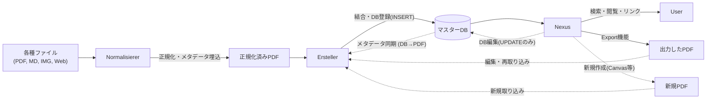

# 開発者向けガイドライン (Developer Guidelines)

Synapsen プロジェクトへの貢献を検討していただきありがとうございます。
このドキュメントでは、本プロジェクトの独特なアーキテクチャと設計思想について解説します。
開発（特に新機能の追加）を行う際は、以下の原則を遵守してください。

## 🏗️ アーキテクチャの原則: PDF中心主義 (PDF-Centric)

Synapsen は一般的なデータベース主導のアプリケーションとは異なり、**「PDFファイルこそが情報の正本 (Single Source of Truth) である」** という思想に基づいています。

### 1. データベースの役割
* **マスターDB (`Synapsen_Master.db`) は、あくまで「検索・活用のためのインデックス（キャッシュ）」に過ぎません。**
* ノートの本体はあくまで Ersteller により統合されたPDF(ノート)です。
* したがって、ファイル実体を伴わないデータの DB への直接登録は禁止されています。
* 又、データベースの内容は、常に統合PDFのメタデータから「再構築可能」な状態である事を推奨します。

### 2. データフローの一方通行性 (と同期)
情報のライフサイクルは、原則として一方向の流れに従いますが、整合性を保つための同期プロセスが存在します。



- 逆流やショートカットは禁止です:
  - ❌ Nexus が新規ノートのレコードを直接 DB に INSERT する。
  - ❌ ファイルを介さずにデータを永続化する。

## 🚫 開発における禁止事項 (Anti-Patterns)
AIアシスタントや開発者が陥りやすい、避けるべき実装パターンです。

1. 「Nexusでノート作成・保存」機能の直接実装
  - Nexus (Canvas含む) で新しいノートやメモを作成する場合、それを直接 DB に保存してはいけません。
  - 正解: 必ず一度「PDFファイル」としてエクスポートし、それを Ersteller のフローに乗せて DB に取り込ませてください。<br><br>
2. DBのみに存在する情報の作成
  - タグやリンク情報は DB に保存されますが、これらは定期的な再構築（Erstellerの``メタデータ同期 (DB→PDF)``によるメタデータの更新や、Nexusのエクスポート機能で出力した物をErstellerで再統合する等）によって担保されるべきです。DBが消えても、PDFさえあれば復旧できる状態を維持してください。

## 🧩 各モジュールの責任範囲
| モジュール | 役割 (Do) | やらないこと (Don't) |
| :--: | -- | -- |
| Normalisierer | ファイルの規格化、OCR、メタデータ(QR)埋め込み | DBへのアクセス、ファイルの結合 |
| Ersteller | PDFの結合、目次作成、DBへの新規登録 (INSERT) | ノートの内容閲覧、検索 |
| Nexus | 検索、閲覧、可視化、メタデータの編集 (UPDATE)、削除 | 新規ノートの登録 (INSERT)、PDF実体の変更 |

---

このアーキテクチャを守ることで、Synapsen は「ファイルベースの堅牢性」と「デジタルの検索性」を両立させています。 機能追加の提案やプルリクエストの際は、この原則に沿っているかをご確認ください。

---

## 🛠 開発環境の構築

### 依存関係のインストール
README.md に記載されている導入手順は、一般ユーザー向けの実行環境を構築するためのものです。[^1]
開発を行う場合は、以下のコマンドを使用して、開発用ツール（Linter, Formatter, Test等）を含む全依存関係をインストールしてください。

```bash
poetry install --no-root --extras full
```

### 推奨される開発環境 (VS Code)
本プロジェクトでは Flask の Jinja2 テンプレートを使用しています。VS Code の標準機能では、HTML ファイル内の `<script>` タグや属性に含まれる Jinja2 構文（`{{ ... }}` や ``）を JavaScript の構文エラーとして検出してしまうことがあります。

これを回避し、正しくシンタックスハイライトを有効にするために、以下の拡張機能のインストールを推奨します：

- **Better Jinja**: Jinja2 構文のハイライトと、HTML/JavaScript 内での正しい解釈をサポートします。

拡張機能をインストールした後、VS Code のユーザー設定 (`settings.json`) に以下を追記し、HTML ファイルを常に Jinja テンプレートとして開くように設定してください。

```json
"files.associations": {
    "*.html": "jinja-html"
}
```

---

## 🏗 EXEのビルド方法

ソースコードを変更した場合など、自分で `Synapsen.exe` をビルドし直す手順です。

1.  **準備:** [開発環境の構築](#-開発環境の構築)を行ってください。
2.  **ビルド:** 以下のコマンドをルートディレクトリで実行してください。
    ```bash
    poetry run pyinstaller --noconsole --onefile --name Synapsen --icon=assets/synapsen.ico --splash "assets/synapsen_banner.png" --collect-all customtkinter --collect-all tkinterdnd2 --collect-all pyzbar --hidden-import="PIL._tkinter_finder" --paths="Synapsen_Normalisierer" --paths="Synapsen_Ersteller" --paths="Synapsen_Nexus" --paths="Synapsen_Web" --add-data="Synapsen_Web/templates;Synapsen_Web/templates" --add-data="Synapsen_Web/static;Synapsen_Web/static" --hidden-import="flask" --hidden-import="dnd_window" --hidden-import="webclip_window" --hidden-import="image_editor" --hidden-import="pdf_utils" --hidden-import="Synapsen_Watchdog" --hidden-import="pdf_processor" --hidden-import="reportlab_generator" --hidden-import="gui_dialogs" --hidden-import="db_recovery_tool" --hidden-import="config_editor" --hidden-import="PDFMargeHelper" --hidden-import="canvas_window" --hidden-import="preview_window" --hidden-import="editor_window" --hidden-import="export_manager" --hidden-import="graph_manager" --hidden-import="list_navigator" --hidden-import="saved_search_manager" --hidden-import="search_parser" --hidden-import="utils" --hidden-import="mixins" Synapsen_Launcher.py
    ```
3.  **配置:** `dist` フォルダに生成された `Synapsen.exe` をルートディレクトリに移動して使用します。

### Tips: 配布用 `Synapsen.exe` のビルド環境について
公式リリースの `Synapsen.exe` は、AI機能やWeb機能を含まない状態でビルドされています。
これを再現するには、以下のコマンドで仮想環境を同期（Sync）させ、余分なライブラリを削除してからビルドを実行してください。

1. **環境の同期:** `poetry install --no-root --sync`
   * これにより、`extras` (AI/Web) が削除され、基本機能と開発ツールのみの環境になります。
2. **ビルド:** 上記の [EXEのビルド方法](#-exeのビルド方法) を実行

※ 環境には `dev` グループ（PyInstaller, pytest等）が含まれますが、Synapsenのソースコードがこれらをインポートしていないため、PyInstallerの仕様により EXE ファイル内には混入しません。

### Tips: 起動速度の改善 (--onedir ビルド)
配布用の `Synapsen.exe` は、利便性を優先して1つのファイルにまとめる `--onefile` 形式でビルドされていますが、これは起動時に一時フォルダへファイルを展開するため、起動に数秒の時間を要します。

ご自身の環境で使用する場合、以下のように **`--onedir`** オプションを使用してビルドすることで、展開処理を省略し、**スクリプト実行並みの高速起動**を実現できます。

```bash
poetry run pyinstaller --noconsole --onedir --name Synapsen --icon=assets/synapsen.ico --splash "assets/synapsen_banner.png" --collect-all customtkinter --collect-all tkinterdnd2 --collect-all pyzbar --hidden-import="PIL._tkinter_finder" --paths="Synapsen_Normalisierer" --paths="Synapsen_Ersteller" --paths="Synapsen_Nexus" --paths="Synapsen_Web" --add-data="Synapsen_Web/templates;Synapsen_Web/templates" --add-data="Synapsen_Web/static;Synapsen_Web/static" --hidden-import="flask" --hidden-import="dnd_window" --hidden-import="webclip_window" --hidden-import="image_editor" --hidden-import="pdf_utils" --hidden-import="Synapsen_Watchdog" --hidden-import="pdf_processor" --hidden-import="reportlab_generator" --hidden-import="gui_dialogs" --hidden-import="db_recovery_tool" --hidden-import="config_editor" --hidden-import="PDFMargeHelper" --hidden-import="canvas_window" --hidden-import="preview_window" --hidden-import="editor_window" --hidden-import="export_manager" --hidden-import="graph_manager" --hidden-import="list_navigator" --hidden-import="saved_search_manager" --hidden-import="search_parser" --hidden-import="utils" --hidden-import="mixins" Synapsen_Launcher.py
```

**注意点:**
- 生成物は `Synapsen.exe` 単体ではなく、`dist/Synapsen/` というフォルダになります。
- フォルダ構造を維持したまま配置・移動する必要があります。
- `config.ini` や `assets` フォルダは、`Synapsen.exe` があるフォルダ（dist/Synapsen/ の中）に配置してください。
  - `assets` フォルダの中身は、`synapsen.ico` と `synapsen_banner.png` のみで動作します。

---

## 📏 開発ルール・規約

### 🐙 Git運用ルール
開発のスムーズな進行と履歴の透明性を保つため、以下のルールに従ってください。

#### 🌳 ブランチ名
開発を行う際は、以下のプレフィックスを使用したブランチ名を作成してください。
区切り文字にはアンダースコア（`_`）を使用することを推奨します。

| Prefix | 対応する内容 | 例 |
| :--: | -- | -- |
| `fix/` | バグ修正 | `fix/ocr_error_handling` |
| `feature/` | 新機能の追加 | `feature/canvas_undo_redo` |
| `change/` | 仕様の変更、リファクタリング | `change/update_ui_theme` |
| `doc/` | ドキュメントの編集 | `doc/update_readme` |

#### 💬 コミットメッセージ
コミットメッセージは `prefix: 内容` の形式で記述してください。
プレフィックスは以下の基準に従ってください。

* `feat: ` 新機能の追加
* `fix: ` バグ修正
* `refa: ` リファクタリング（機能追加やバグ修正を含まないコードの変更）
* `change: ` 仕様変更
* `doc: ` ドキュメントのみの変更

例: `feat: CanvasにUndo機能を追加`

### 🐍 コーディング規約
コードの品質と一貫性を保つため、以下の基準を設けています。

#### 🛠 ツール・環境 (Python)
* **フォーマッター**: [Black](https://github.com/psf/black)
* **リンター**: [Flake8](https://github.com/PyCQA/flake8)

**💻 VS Codeをご利用の方へ（推奨）**
VS Codeを使用する場合は、以下のMicrosoft公式拡張機能の導入を推奨します。これらを使用することで、保存時に自動フォーマットやリントが行われます。
* [Black Formatter](https://github.com/microsoft/vscode-black-formatter)
* [Flake8](https://github.com/microsoft/vscode-flake8)

#### 📏 命名規則 (Naming Convention)
基本的に [PEP 8](https://peps.python.org/pep-0008/#naming-conventions) の命名規則に従ってください。

| 種類 | 形式 | 例 |
| :-- | :-- | :-- |
| **定数** | アッパースネークケース (UPPER_CASE) | `MAX_PAGES`, `DEFAULT_COLOR` |
| **変数・関数・メソッド** | ローワースネークケース (snake_case) | `user_name`, `calculate_total()` |
| **クラス** | キャメルケース (CapWords) | `NoteManager`, `PDFProcessor` |
| **モジュール (ファイル名)** | ローワースネークケース (snake_case) | `pdf_utils.py`, `main_window.py` |

#### 📝 ドキュメンテーション (Docstring)
関数やクラスには、**Google Style** のDocstringを記述することを推奨します。
型ヒント (Type Hints) も積極的に活用してください。

例:
```python
def normalize_pdf(input_path: str, output_path: str) -> bool:
    """
    PDFを指定されたサイズに正規化します。

    Args:
        input_path (str): 入力ファイルのパス
        output_path (str): 出力ファイルのパス

    Returns:
        bool: 成功した場合はTrue、失敗した場合はFalse
    """
    ...
```

---

[^1]: [README.md の導入手順](README.md#b-ソースコード-スクリプト-から実行する場合-高速起動) では `--without dev` オプションを使用しているため、開発に必要なパッケージが含まれません。