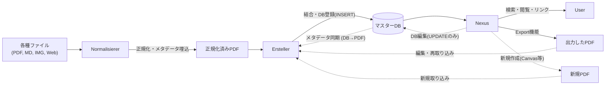

# 開発者向けガイドライン (Developer Guidelines)

Synapsen プロジェクトへの貢献を検討していただきありがとうございます。
このドキュメントでは、本プロジェクトの独特なアーキテクチャと設計思想について解説します。
開発（特に新機能の追加）を行う際は、以下の原則を遵守してください。

## 🏗️ アーキテクチャの原則: PDF中心主義 (PDF-Centric)

Synapsen は一般的なデータベース主導のアプリケーションとは異なり、**「PDFファイルこそが情報の正本 (Single Source of Truth) である」** という思想に基づいています。

### 1. データベースの役割
* **マスターDB (`Synapsen_Master.db`) は、あくまで「検索・活用のためのインデックス（キャッシュ）」に過ぎません。**
* ノートの本体はあくまで Ersteller により統合されたPDF(ノート)です。
* したがって、ファイル実体を伴わないデータの DB への直接登録は禁止されています。
* 又、データベースの内容は、常に統合PDFのメタデータから「再構築可能」な状態である事を推奨します。

### 2. データフローの一方通行性 (と同期)
情報のライフサイクルは、原則として一方向の流れに従いますが、整合性を保つための同期プロセスが存在します。



- 逆流やショートカットは禁止です:
  - ❌ Nexus が新規ノートのレコードを直接 DB に INSERT する。
  - ❌ ファイルを介さずにデータを永続化する。

## 🚫 開発における禁止事項 (Anti-Patterns)
AIアシスタントや開発者が陥りやすい、避けるべき実装パターンです。

1. 「Nexusでノート作成・保存」機能の直接実装
  - Nexus (Canvas含む) で新しいノートやメモを作成する場合、それを直接 DB に保存してはいけません。
  - 正解: 必ず一度「PDFファイル」としてエクスポートし、それを Ersteller のフローに乗せて DB に取り込ませてください。<br><br>
2. DBのみに存在する情報の作成
  - タグやリンク情報は DB に保存されますが、これらは定期的な再構築（Erstellerの``メタデータ同期 (DB→PDF)``によるメタデータの更新や、Nexusのエクスポート機能で出力した物をErstellerで再統合する等）によって担保されるべきです。DBが消えても、PDFさえあれば復旧できる状態を維持してください。

## 🧩 各モジュールの責任範囲
| モジュール | 役割 (Do) | やらないこと (Don't) |
| :--: | -- | -- |
| Normalisierer | ファイルの規格化、OCR、メタデータ(QR)埋め込み | DBへのアクセス、ファイルの結合 |
| Ersteller | PDFの結合、目次作成、DBへの新規登録 (INSERT) | ノートの内容閲覧、検索 |
| Nexus | 検索、閲覧、可視化、メタデータの編集 (UPDATE)、削除 | 新規ノートの登録 (INSERT)、PDF実体の変更 |

---

このアーキテクチャを守ることで、Synapsen は「ファイルベースの堅牢性」と「デジタルの検索性」を両立させています。 機能追加の提案やプルリクエストの際は、この原則に沿っているかをご確認ください。

---

## 🏗 EXEのビルド方法

ソースコードを変更した場合など、自分で `Synapsen.exe` をビルドし直す手順です。

1.  **準備:** `Install.bat` の実行に加え、PyInstallerをインストールします。
    ```bash
    pip install pyinstaller
    ```
2.  **ビルド:** 以下のコマンドをルートディレクトリで実行してください。
    ```bash
    pyinstaller --noconsole --onefile --name Synapsen --icon=assets/synapsen.ico --splash "assets/synapsen_banner.png" --collect-all customtkinter --collect-all tkinterdnd2 --collect-all pyzbar --hidden-import="PIL._tkinter_finder" --paths="Synapsen_Normalisierer" --paths="Synapsen_Ersteller" --paths="Synapsen_Nexus" --hidden-import="dnd_window" --hidden-import="webclip_window" --hidden-import="image_editor" --hidden-import="pdf_utils" --hidden-import="Synapsen_Watchdog" --hidden-import="pdf_processor" --hidden-import="reportlab_generator" --hidden-import="gui_dialogs" --hidden-import="db_recovery_tool" --hidden-import="config_editor" --hidden-import="PDFMargeHelper" --hidden-import="canvas_window" --hidden-import="preview_window" --hidden-import="editor_window" --hidden-import="export_manager" --hidden-import="graph_manager" --hidden-import="list_navigator" --hidden-import="saved_search_manager" --hidden-import="search_parser" --hidden-import="utils" --hidden-import="mixins" Synapsen_Launcher.py
    ```
3.  **配置:** `dist` フォルダに生成された `Synapsen.exe` をルートディレクトリに移動して使用します。

### Tips: 起動速度の改善 (--onedir ビルド)
配布用の `Synapsen.exe` は、利便性を優先して1つのファイルにまとめる `--onefile` 形式でビルドされていますが、これは起動時に一時フォルダへファイルを展開するため、起動に数秒の時間を要します。

ご自身の環境で使用する場合、以下のように **`--onedir`** オプションを使用してビルドすることで、展開処理を省略し、**スクリプト実行並みの高速起動**を実現できます。

```bash
# --onefile を --onedir に変更して実行
pyinstaller --noconsole --onedir --name Synapsen --icon=assets/synapsen.ico --splash "assets/synapsen_banner.png" --collect-all customtkinter --collect-all tkinterdnd2 --collect-all pyzbar --hidden-import="PIL._tkinter_finder" --paths="Synapsen_Normalisierer" --paths="Synapsen_Ersteller" --paths="Synapsen_Nexus" --hidden-import="dnd_window" --hidden-import="webclip_window" --hidden-import="image_editor" --hidden-import="pdf_utils" --hidden-import="Synapsen_Watchdog" --hidden-import="pdf_processor" --hidden-import="reportlab_generator" --hidden-import="gui_dialogs" --hidden-import="db_recovery_tool" --hidden-import="config_editor" --hidden-import="PDFMargeHelper" --hidden-import="canvas_window" --hidden-import="preview_window" --hidden-import="editor_window" --hidden-import="export_manager" --hidden-import="graph_manager" --hidden-import="list_navigator" --hidden-import="saved_search_manager" --hidden-import="search_parser" --hidden-import="utils" --hidden-import="mixins" Synapsen_Launcher.py
```

**注意点:**
- 生成物は `Synapsen.exe` 単体ではなく、`dist/Synapsen/` というフォルダになります。
- フォルダ構造を維持したまま配置・移動する必要があります。
- `config.ini` や `assets` フォルダは、`Synapsen.exe` があるフォルダ（dist/Synapsen/ の中）に配置してください。
  - `assets` フォルダの中身は、`synapsen.ico` と `synapsen_banner.png` のみで動作します。
