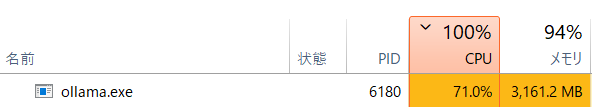
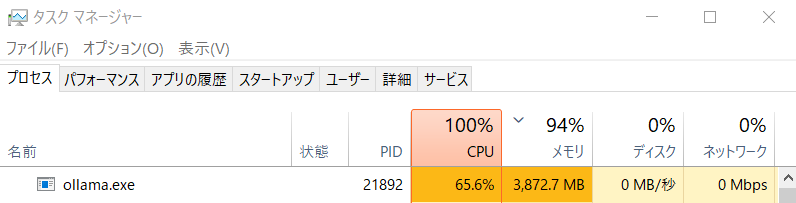
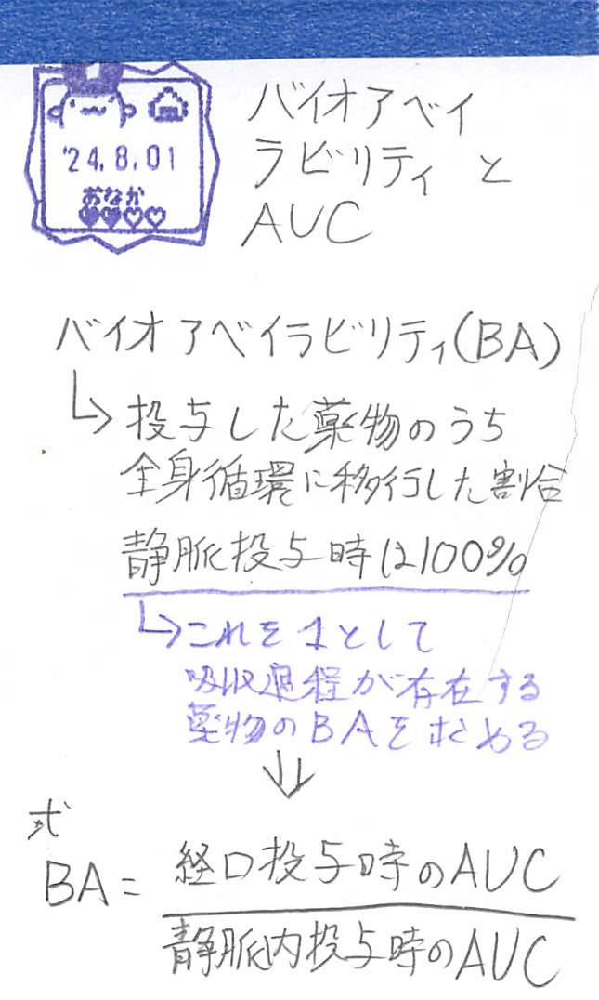

# 🧠 AIによるメタデータ自動付与 (実験的機能)

ローカルLLM (Ollama) を使用して、蓄積されたノートの内容を分析し、**検索用キーワード**と**要約**を自動的にデータベースへ追記する拡張スクリプトです。

> **⚠️ 注意:**
> * この機能は実験的なものです。
> * 大量のノートを処理する場合、マシンスペックによっては時間がかかります。
>
> **実験的機能として扱っている理由:**
> * 導入難易度が高く、処理速度がPCスペックに大きく左右されるため。
> * 「自動要約」および「自動キーワード抽出」は、ノートを一元管理するツールとしては有用ですが、自分の言葉でリンクを作る「Zettelkasten（ツェッテルカステン）」の思想としては補助的な役割に留まるため。

## 機能
* データベース内の「未処理のノート」を自動検出します。
* AIがノート本文を読み、「キーワード」と「要約」を生成します。
* 生成された情報は、ノートの「メモ」欄に自動追記されます。
* **除外機能**: ノートに `SkipAISummary` タグを付与することで、そのノートを処理対象から除外できます。

## 必要な環境

本機能を使用するには、以下の環境構築が必要です。

1. **Ollama**: [Ollama公式サイト](https://ollama.com/) からインストールし、バックグラウンドで起動していること。
    * 導入方法は、こちらの解説記事などを参考にしてください。<br>
        → **[最新 LLM をお手軽に実行！ollamaを使おう](https://qiita.com/hiyoko1729/items/4fa92e1e88ddd68d4e30)**

2. **LLMモデル**: 以下のモデル等が Ollama で利用可能であること。

    * **A. 標準モデル (手軽に試したい場合)**
        * モデル名: `gemma3:4b`
        * 導入コマンド: `ollama pull gemma3:4b`
        * **特徴**: コマンド一つで導入でき、検証の結果、一般的なPCでも十分に高速に動作することが確認されています。まずはこのモデルで動作確認することをお勧めします。

    * **B. 推奨カスタムモデル (精度と効率を重視する場合)**
        * モデル名: `hf.co/unsloth/gemma-3-4b-it-qat-GGUF:Q4_K_M` 等
        * 導入方法: Hugging FaceからGGUFファイルをダウンロードし、Modelfileを作成して取り込みます。
        * **特徴**: Unslothによって最適化（QAT/量子化意識学習）されたモデルです。標準モデルと同等の速度で、より高品質な出力が期待できます。
        > **⚠️ Note:** Hugging FaceからGemma系モデルのGGUFを直接ダウンロードする場合、Googleの[Gemma利用規約](https://ai.google.dev/gemma/terms)への同意が必要になることがあります（Hugging FaceアカウントでのログインとAccess Requestが必要）。

3. **Pythonライブラリ**: `ollama` が導入済みであること。
    * **pipを使用する場合**:
      ```bash
      pip install ollama
      ```
    * **Poetryを使用する場合** (Synapsen開発環境):
      `Synaosen_AI_Tagger` フォルダ下で以下を実行します。
      ```bash
      poetry install --no-root --extras ai
      ```
---

4. **Synapsenの設定**(**config.ini**)
    * `[Automation]`セクションに以下の設定が記載済みな事
      ```ini
      [Automation]

      ; --- Ollama 設定 ---
      ; OllamaサーバーのURL (AI_Tagger / Normalisierer 共通)
      ; ベースURLを指定してください。
      ollama_api_url = http://localhost:11434

      ; --- AI Tagger (分類・要約) 用 ---
      ; テキスト処理に強いモデル、またはVisionモデルを指定してください
      ollama_tagger_model = hf.co/unsloth/gemma-3-4b-it-qat-GGUF:Q4_K_M
      ```
    * 注意:
      * `ollama_api_url`は[[ローカルLLMを使用したOCR機能]](../../docs/Feature_Local_LLM_OCR/Feature_Local_LLM_OCR.md/#2-設定-configini)の設定でもあります。
      * したがって[ローカルLLMを使用したOCR機能]を既に使用している場合は、同様の記載をすでに行っています。

## 使用方法
-  ルートディレクトリにて以下のコマンドを実行すると、対話形式で処理が開始されます。
    ```bash
    poetry run python Extras/Synapsen_AI_Tagger/Synapsen_AI_Tagger.py
    ```

---

## 📊 動作検証レポート (Benchmark)

GPUを搭載しない一般的なビジネスノートPCでの動作検証結果です。<br>
OllamaはCPUのみでも動作しますが、処理時間はマシンスペックとテキスト量に依存します。導入の目安として参照してください。<br>

### 1. 検証環境 (Test Environment)
数年前の標準的なビジネスノートPC（GPUなし、メモリ8GB）を使用しています。

* **PC**: Panasonic Let's Note CF-SV7 (CF-SV7RDAVS)
* **CPU**: Intel® Core™ i5-8350U vPro™ (1.70 GHz)
* **GPU**: Intel UHD Graphics 620 (CPU内蔵)
* **RAM**: 8GB
* **OS**: Windows 10 Pro 64bit
* **使用モデル**: 
    * 標準: `gemma3:4b`
    * 検証用: `hf.co/unsloth/gemma-3-4b-it-qat-GGUF:Q4_K_M`

### 2. 処理時間の実測値 (Performance)
テキストの内容や長さごとの処理時間は以下の通りです。<br>
※ スクリプトの仕様上、**長文は自動的に一定文字数（約3000文字）に切り詰められて**からAIに渡されます。<br>

> **💡 開発者コメント:**
> メモリ8GB・iGPUの環境でも、1ファイルあたり2〜3分程度で処理が完了します。
> バックグラウンドで放置して処理させる運用であれば、十分に実用的です。
> 標準の `gemma3:4b` でも十分高速ですが、より応答精度を追求したい場合は、`Unsloth QAT版` などのカスタムモデル導入も検討してください。

#### A. 標準モデル (gemma3:4b)
| 対象ファイル | 文字数 (概算) | 処理時間 | 備考 |
| :--- | :--- | :--- | :--- |
| **手書きメモ** (OCR精度:低) | 50 ~ 180文字 | **約 30秒** | 文章として成立していなくても要約可能 [^1] |
| **ドキュメント** (Markdown) | 6,000文字 | **約 2分18秒** | Synapsen CONTRIBUTING.md |
| **マニュアル** (Markdown) | 38,000文字 | **約 2分30秒** | Synapsen README.md |
| **書籍/漫画** (OCR) | 3.5万 ~ 65万文字 | **約 2分20秒** ~ **3分12秒** | 入力制限により冒頭部分を重点的に分析 |

#### B. 推奨カスタムモデル (Unsloth QAT版)
*Model: hf.co/unsloth/gemma-3-4b-it-qat-GGUF:Q4_K_M*

| 対象ファイル | 文字数 (概算) | 処理時間 | 備考 |
| :--- | :--- | :--- | :--- |
| **手書きメモ** (OCR精度:低) | 50 ~ 180文字 | **約 30秒** | 文章として成立していなくても要約可能 [^1] |
| **ドキュメント** (Markdown) | 6,000文字 | **約 2分20秒** | Synapsen CONTRIBUTING.md |
| **マニュアル** (Markdown) | 38,000文字 | **約 2分40秒** | Synapsen README.md |
| **書籍** (OCR) | 80万文字 | **4分0秒** | 入力制限により冒頭部分を重点的に分析 |
| **テキスト** (Markdown) | **2分52秒** | 3,273文字<br>(本文 2,862文字) | [専門的な講義ノート (薬物動態学: 分布容積)](<../../samples/20250721_025900_投与設計の第一歩 -分布容積の理解-_資料.md> "20250721_025900_投与設計の第一歩 -分布容積の理解-_資料.md") |

### 3. 稼働状況
**gemma3:4b (標準)**<br>


**Unsloth QAT版 (GGUF)**<br>


<br>
この環境でスクリプトを使用した時の、実際の `ollama.exe` プロセスの様子です。<br>
CPUリソースを大きく消費しますが、バックグラウンドでの動作は可能です。

### 4. 出力サンプル (Sample Output)
実際にこの環境で生成されたメタデータの例です。

**対象: README.md (Synapsen メインドキュメント)**
* **gemma3:4b**
    ```json
    {
      "keywords": ["デジタルツェッテルカステン", "PDFノート", "正規化", "コモンプレイス・ブック", "Index Key"],
      "summary": "Synapsenは、スキャンしたPDFノートをデジタルツェッテルカステン風に管理・閲覧するためのツールセットです。PDFの正規化、メタデータの埋め込み、ノートの統合、そして視覚的な整理機能（Canvas）を提供し、情報の一元管理と知識の構造化を支援します。"
    }
    ```
* **Unsloth QAT版**
    ```json
    {
      "keywords": ["PDFノート", "Zettelkasten", "正規化", "メタデータ", "Index Key"],
      "summary": "Synapsenは、スキャンしたPDFノートやドキュメントをデジタル・ツェッテルカステン風に管理・閲覧するためのツールセットです。NormalisiererでPDFの形式を統一し、Erstellerでメタデータを付与して統合し、Nexusで検索・リンク機能を用いて閲覧・編集します。さらにCanvasではカードとしてノートを整理することで新たな知見を生み出します。"
    }
    ```

**対象: CONTRIBUTING.md (開発者ガイド)**
* **gemma3:4b**
    ```json
    {
        "keywords": ["PDF中心主義", "マスターDB", "メタデータ同期", "一方向性", "ファイルベースの堅牢性"],
        "summary" : "Synapsenプロジェクトでは、PDFファイルを情報の正本として扱い、データベースはメタデータインデックスとして機能します。情報のライフサイクルは一方向の流れに従い、データベースの内容は常にPDFメタデータから再構築される必要があります。"
    }
    ```
* **Unsloth QAT版**
    ```json
    {
      "keywords": ["PDF中心主義", "マスターDB", "データフロー", "同期", "ファイルベースの堅牢性"],
      "summary": "Synapsenプロジェクトでは、PDFファイルを情報の正本とみなし、データベースはあくまでメタデータのインデックスとして機能します。情報のライフサイクルは一方向の流れであり、データベースの更新はPDFのメタデータに基づき行われます。Nexusでのノート作成・保存を直接DBに保存せず、PDFエクスポート後に取り込むことを推奨し、DB消失時でもPDFがあれば復旧できる状態を維持することが重要です。"
    }
    ```

**対象: 専門的な講義ノート (薬物動態学: 分布容積)**
* 入力データ: 対話形式で記述された、薬学の講義録（PDF）の全文テキスト (2,991文字)。
* **Unsloth QAT版**
    ```json
    {
      "keywords": ["分布容積 (Vd)", "濃度", "溶媒", "組織への移行", "負荷投与"],
      "summary": "このテキストは、分布容積という薬物動態の概念を、コップとインクの例えを用いて分かりやすく解説しています。分布容積は、薬の投与量と血中濃度の関係から推定される「見かけ上の容積」であり、実際の体液量よりも大きくなることがあります。これは、薬が血液だけでなく組織にも移行するためです。臨床応用としては、患者さんの脂肪量を考慮した適切な投与量の決定や、目標とする血中濃度に素早く到達させるための負荷投与量の設定に役立ちます。"
    }
    ```
> **💡 Point:**
> 3000文字以内の標準的なノートであれば、AIはテキストの**冒頭から末尾まで全ての内容を考慮**して、このように高精度な要約とキーワード選定を行います。

**対象: 手書きのメモ (Tesseract OCR による OCR化を行ったもの)**
* 元の画像: 
  * 
* 実際のテキスト(fulltext):
  * ```plain text
    人 7 べり BADううちピPt JpSosge 」
     きこも をうてんが うるタ ち je とる式
    ```

* **出力結果 (両モデル共通)**
    ```json
    {
      "keywords": ["文字", "記号", "言語", "コード", "ベリ"],
      "summary": "提供されたテキストは、文字、記号、言語、コードといった要素を含む、意味不明な文字列の組み合わせです。特に「ベリ」という単語が複数回出現しており、その意味や文脈は不明です。このテキストは、おそらく何らかのデータやメッセージの一部である可能性があります。"
    }
    ```

---

## 謝辞 (Acknowledgements)
本ツールは、以下の優れたオープンソースソフトウェアによって実現されました。<br><br>
また、このプロジェクトの設計、およびドキュメント整備は、GoogleのAIである **Gemini** の支援を受けて行われました。

* **[ollama-python](https://github.com/ollama/ollama-python)**
    * License: [MIT License](https://github.com/ollama/ollama-python/blob/main/LICENSE)
    * Copyright (c) 2024 Ollama

---

[^1]: [対象: 手書きのメモ](#4-出力サンプル-sample-output)を参考。要約は正しく行われないが、コードは正常に動作する。`SkipAISummary` タグをノートを付与することで、自動要約の対象から除外できる。
