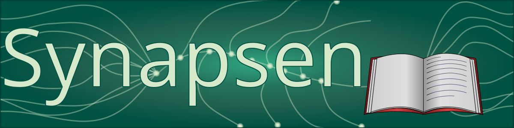

# Synapsen - PDFノート管理ツールセット

`Synapsen` (シナプセン) は、スキャンしたPDFノートやドキュメントを、デジタル・ツェッテルカステン（Zettelkasten）風に管理・閲覧するためのツールセットです。

このプロジェクトは、以下の3つの連携するアプリケーションで構成されています。

1.  **Normalisierer (正規化):** PDFのフォームや手書き注釈をページに焼き込み（フラット化）、指定サイズ (A4/A5) に統一します。メタデータの埋め込みも行います。
2.  **Ersteller (作成・統合):** ノートにメタデータを付与・抽出し、月ごとに1冊のPDFに統合します。
3.  **Nexus (閲覧・検索):** 統合されたノートのデータベースを、強力な検索・リンク機能で閲覧・編集します。
4.  **Canvas (構造化・思考):** ノートをカードとして自由に配置し、視覚的に接続・整理して新たな知見を生み出します。(**Nexus内の機能**です)

## 思想・コンセプト

このツールセットは、書籍[『情報は1冊のノートにまとめなさい［完全版］』](https://ndlsearch.ndl.go.jp/books/R100000002-I025014527)(奥野 宣之 著, ISBN: 9784478022009) で紹介されている、**情報を一元管理する**という思想に強く感銘を受けて作成されました。アナログ・デジタルの情報を一元化し、「時系列」で管理しつつ「タグ」や「目次」で検索性を高めるという理論を、スキャンPDFや電子ペーパー(デジタルノート)で実現することを目的としています。

これに加え、本ツールは伝統的な知識管理術である「**コモンプレイス・ブック (Commonplace Book)**」の概念も取り入れています。
本ツール独自の **Index Key (コモンプレイス Key)** は、この「コモンプレイス」のKey（索引）の概念に由来しており、時系列やタグとは異なる「テーマ」や「概念」でノートを横断するための機能です。

## 構成ツールと機能

### 1. Synapsen Normalisierer (正規化ツール)

スキャンしたPDF、Markdownファイル、Webページ、画像などを、`Ersteller` で処理できる形式に変換します。

* **PDFフォームと注釈のフラット化:**
    * PDFフォーム（テキストボックス等）の入力内容を、テキストとしてページに焼き込みます。
    * **インク注釈のフラット化設定 (`flatten_ink_annotations`)**:
        * `config.ini` で `true` に設定すると、ハイライトとリンク以外の注釈（手書きインク等）をページ背景に焼き付けます。
          * ※筆圧情報は失われます
        * `false` (デフォルト) に設定すると、インク注釈をそのまま維持します。筆圧情報（入り抜き等）は保たれますが、デバイスによっては動作が重くなる可能性があります。
        * **※注意:** `false` 設定でサイズ正規化（Erstellerでのヘッダー・フッター領域確保のためのリサイズ処理を含む）が行われたページに対し、QUADERNO等の端末上でペンの書き込みや消去を行うと、仕様により手書きインクの注釈のサイズが元に戻り、表示が崩れたりする場合があります。
* **サイズ正規化:** すべてのPDFページを `config.ini` で指定された用紙サイズ（A4またはA5）の縦サイズに（アスペクト比を維持して）リサイズ・中央配置します。
* **D&D / ペーストによるクリップ:**
    * `PDF`, `PNG`, `JPG`, `MD` (Markdown) ファイルのD&D、またはクリップボードのスクリーンショット（Ctrl+V）に対応します。
    * **画像補正 (Microsoft Lens 風機能):**
        * 取り込んだ画像に対し、**Microsoft Lens (旧 Office Lens)** のような4隅指定による台形補正を行い、正面から見た画像に変形・トリミングする機能を搭載しています。
        * モバイルアプリやクラウド機能に頼ることなく、**PC上のローカル操作だけで**スキャン画像やホワイトボードの写真を直感的に補正・取り込みできます。
    * **リスト編集・統合機能:**
        * **クイックプレビュー:** リスト上のアイコンにマウスオーバーするだけで、画像の内容（またはPDFの表紙）をポップアップで確認できます。
        * **並び替え:** アイコンをドラッグすることで、ファイルの結合順序を直感的に変更可能です。
        * **ファイルの統合:** 「処理対象ファイルを1つのノートに統合する」オプションを使用することで、**バラバラの画像やPDFを1つのPDFノートとしてまとめて正規化**できます。
    * **タグ情報の自動埋め込み:**
        * **書誌情報の入力:** 著者名やサイト名を入力すると、情報源であることを示す識別子が埋め込まれ、システム取り込み時に **`ZTypes_Source`** タグが自動付与されます。
        * **WebClipとして扱う:** チェックボックスをONにすると、手動クリップであっても **`SType_WebClip`** および **`ZTypes_Source`** タグが自動付与されます。
    * 実行時に **IndexKey**, **コメント**, **書誌情報** を一括で指定可能です。
    * **Markdown (.md) ファイル**は、`Pandoc`と`Playwright`を経由してPDFに自動変換されます。 `<details>`タグは自動的に展開（`<details open>`）され、内容がPDFに含まれます。
* **Webクリップ (URLからPDF化):**
    * 指定したURLを `Playwright` を使用してPDFとして保存します。
    * **PDFや画像ファイルへの直接URL**にも対応。HTML以外はファイルを直接ダウンロードして正規化します。
    * 実行時に **IndexKey**, **コメント**, **書誌情報**（著者名、サイト名など）を入力可能です。
    * Webクリップとして作成されたPDFには、システム取り込み時に **`SType_WebClip`** および **`ZTypes_Source`** タグが自動付与されます。
    > **💡 Tips: 自動Webクリップがうまくいかない場合（手動クリップ）**
    > ログインが必要なサイトや、動的なコンテンツにより自動取得が崩れてしまう場合は、以下の「手動クリップ」運用が推奨されます。
    > 1.  **ブラウザの機能でPDF化:**
    >     * ブラウザの「印刷 > PDFとして保存」機能を使用して、ページをPDF化します。
    >     * Edgeの「スマート印刷」オプションで印刷すると、より正常に印刷できます
    > 2.  **スクリーンショット:**
    >     * 見た目をそのまま保存したい場合は、ページ全体のスクリーンショットを撮り、クリップボードにコピーします。
    > 3.  **Normalisiererへ取り込み:**
    >     * 保存したPDFを「**D&D / ペースト**」ウィンドウにドロップするか、スクリーンショットを `Ctrl+V` で貼り付けます。
    >     * このウィンドウで「URL」や「サイト名」などの書誌情報を手動入力し、「**WebClipとして扱う**」にチェックを入れることで、自動クリップと同様のタグ・メタデータ付き正規化PDFを作成できます。

* **クリップ形式(共通):**
    * 「D&D/ペースト」および「Webクリップ」で生成されるPDFは、**1ページ目にIndexKeyとユニークID (`key`) を持つQRコード**が埋め込まれます。
    * 又、**最終ページ（新規追加）にコメント・書誌情報・引用Key情報を持つQRコード**が挿入されます。
* **テキスト抽出 (OCR):**
    * PDFに埋め込まれた**既存のテキストレイヤー（テキストベースPDF）を抽出**します。
    * (オプション) `config.ini` で `enable_tesseract_ocr = true` に設定すると、テキストレイヤーが存在しない**画像PDF**（画像クリップやスキャンPDF）に対し、Tesseract OCR を使用してテキストを抽出し、検索可能な「透明テキストレイヤー」としてPDFに埋め込みます。

### 2. Synapsen Ersteller (統合・作成ツール)

正規化されたPDFを読み込み、メタデータを編集し、月報のような形で1つのPDFにまとめ上げます。

* ファイル名から日付やタイトルを自動抽出 (`YYYYMMDD_hhmmss_タイトル.pdf` 形式を推奨)。
    * **（重要）**
        > * この形式は `Nexus` でのリンク機能（`[[key]]`）の基盤となるユニークID（`key`）を生成するために必須です。
        > * この形式でないファイルは `key` を持たず、マスターDBへの登録やリンク対象から除外されます。
* **メタデータの自動抽出:**
    * **1. PDFメタデータ (最優先)**
        * `Normalisierer` でクリップされたPDFには、メタデータ（Subjectフィールド）に隠しJSONとして情報が埋め込まれています。これを最優先で読み取ります。
    * **2. QRコード**
        * `Normalisierer` が埋め込んだQRコードを `pyzbar` で読み取り、**Index Key**、**ユニークID (`key`)**、および**引用情報（Refs）**を抽出します。
        * これは読み取りの**フォールバック（安全策）**として機能するだけでなく、**印刷して紙媒体として利用している状態やNexusを起動していない状態**からでも、QRコードをスキャンすることで**Keyや引用元情報へアクセス可能にする**役割も担っています。
    * **3. テキスト読み取り**
        * PDFの特定座標（`config.ini` の `[Extraction]` で設定）からIndex Keyを自動抽出します。
        * PDFテンプレート(フォーム付き)で設定した、IndexKeyを抽出する事を目的としています。
* **タグの自動付与 (Auto-Tagging):**
    * `Normalisierer` で埋め込まれた識別子やファイル名に基づき、以下のタグを自動的に付与します。
    * **システム出力タイプ (`SType_`):**
        * **`SType_Canvas`**: Nexus Canvasで作成されたホワイトボード全体のPDF
        * **`SType_Sticky`**: Nexus Canvasの「付箋」から作成されたPDF
        * **`SType_WebClip`**: Webクリップ機能（または手動クリップ）で作成されたPDF
        * **`SType_MOC`**: Nexusのエクスポート機能で作成された目次ノート (Map of Content)
    * **思考の段階タイプ (`ZTypes_`):**
        * **`ZTypes_Source`**: 情報源。Webクリップや、書誌情報が入力されたファイルに自動付与されます。
* "サイドノート"（例: `..._Note.pdf`）に親ノートのIndex Keyを自動継承。
    * これは 電子ペーパー「QUADERNO (クアデルノ)」の "サイドノート" 機能を意識した物です。
* ノートごとにタグ、メモ、Index Key（索引キー）を編集。
* 複数のノートを選択し、Index Keyやタグを一括で設定（追加・削除）する**バッチ編集機能**。
* 指定した月のノート群を1つのPDFに統合。
* （LuaLaTeXを使用し）目次、タグ索引、Index Key索引を自動生成。
* **データ保全・復旧機能:**
    * **メタデータ埋め込み:** 統合PDF生成時、全ノートのメタデータ（JSON）をPDFの添付ファイルとして埋め込みます。 これにより、元ファイルやDBが消失しても**統合PDF単体から完全に復旧可能**です。
    * **DB復旧ツール:** 万が一データベースが破損・紛失した場合でも、統合PDFからデータベースを再構築できる専用GUIツールを搭載しています。
        * ウィンドウ右上のボタンから起動します。
        * 初期状態では表示が隠れているため、使用する際はウィンドウの横幅を広げてください。
    * **容量削減:** 復旧時、本文テキスト（`full_text`）は統合PDFのページから再抽出するため、埋め込みデータのサイズは最小限に抑えられます。
* 「統合PDFを生成」する際、`Normalisierer` が埋め込んだ**本文テキスト（`full_text`）をPDFからオンデマンドで抽出し**、マスターDBに保存。
* 統合PDFの索引情報となる**マスターDB（SQLite / `.db`ファイル）**（`Nexus`が使用）に**情報を追記**。
* 現在の作業リストを中間ファイル（CSV）として（`full_text` を除いて）保存・読み込みする機能。

### 3. Synapsen Nexus (閲覧・検索ツール)

`Ersteller` が作成・追記した**マスターDB（SQLite / `.db`ファイル）**を読み込む、ノート閲覧・検索用のアプリケーションです。

* **高度な検索:**
    * **非同期検索:** 検索ロジックをバックグラウンドで実行することで、大量のノートや重い全文検索を行ってもアプリの動作がフリーズしません。
    * `AND`, `OR`, `NOT(-)`, `( )` 演算子を使った検索。
    * `tag:`, `memo:`, `ikey:`, `fulltext:` (または `text:`) などのプレフィックス検索。
    * `filename:` (または `file:`) で、特定の統合PDFファイルに含まれるノートのみを検索可能。
    * `is:orphan` で、どこからもリンクされていない（孤立した）ノートを検索可能。
    * `date:>=YYYYMMDD` (以降), `date:<=YYYYMMDD` (以前), `date:YYYYMMDD-YYYYMMDD` (期間) などの**高度な日付範囲検索**。
    * PDF本文（`full_text`）を検索対象に含める「**本文検索**」チェックボックス。
    * 「保存済み検索」でよく使う検索を登録可能。
* **プレビューと編集:**
    * 検索結果のノートをダブルクリックすると、統合PDFの該当ページを直接表示。
    * 検索結果のノートをシングルクリックすると、右ペインに詳細と**PDFの1ページ目インラインプレビュー**を表示。
    * メモ内の `[[key]]` 形式のリンクから、別のノートを**簡易プレビュー**（読み取り専用ウィンドウ）で表示。**プレビューウィンドウから直接編集画面へ遷移**することも可能。
    * ノート詳細表示時に、そのノートを引用している他のノート（被リンク元）を自動でリストアップ。
* **グラフ可視化:**
    * **全体グラフ (Global):** 現在の検索結果に基づき、ノート間のリンクを全体的に可視化。
    * **関連グラフ (Local):** 選択したノートを中心とした、直接的なつながりを可視化。
    * **選択グラフ (Selected):** 複数選択したノートのみの関係性を可視化し、一時的な比較や構造化に利用可能。
    * グラフ上のノードをダブルクリックでPDFを開いたり、右クリックでKeyをコピーすることが可能。
* **ナレッジワーク(創造的な情報の活用)支援機能:**
    * **複数選択:** チェックボックスによるノートの複数選択。
    * **リンクの一括コピー:** 選択したノートのリンク（`[[Key: Title]]`）を一括でクリップボードにコピーし、MOC（目次ノート）の作成を支援。
    * **ランダムノート（閃き）:** 現在の検索結果や全ノートからランダムにノートを表示。
    * **保存済み検索:** 現在の検索クエリを保存・管理・呼び出しできる「スマートフォルダ」機能。
    * **除外タグ切り替え:**
        * `config.ini` で指定したタグ（例: `Status_Archive`, `Status_Done`）を持つノートを、検索結果からデフォルトで除外します。
        * 画面上のチェックボックス（例: 「除外: Status_Archive」）をOFFにすることで、一時的に除外を解除し、全てのノートを表示できます。
* **データ保護:**
    * **自動バックアップ:** アプリ終了時に、データベースのバックアップコピーを `db_backups` フォルダに自動作成します（日次更新）。
        * 直近7日分のデータが保持され、それより古いバックアップは自動的に削除されます。
* **エクスポート:**
    * 検索結果全体、または**選択したノートのみ**を対象にエクスポート可能。
    * メタデータCSV、本文TXT、グラフHTMLに加え、対象ノートを結合した**統合PDF（しおり付き）**を一括で出力可能。
    * **MOC (Markdown) 出力:** 選択したノートへのリンク集（Map of Content）をMarkdownファイルとして出力。これをNormalisiererでPDF化することで、目次ノートとしてシステムに取り込むことができます。（取り込み時に `SType_MOC` タグが自動付与されます）
* **DB直接編集:**
    * ノートのメタデータ（メモ、タグ、Index Key）をDBに直接書き込み・編集・削除する機能。

* **補遺:**
    * アプリは `config.ini` で指定された**マスターDB**を自動で読み込みます。
    * **PDFの自動検索:**
        * ノートに関連付けられた統合PDFや元ファイルは、`config.ini` で設定した **`pdf_root_folder`** および **`pdf_archive_folder`** 内（サブフォルダを含む）から**自動的に検索・参照されます。**
        * これにより、ファイルの場所を(マスターDB直下のフォルダから)移動しても、設定されたフォルダ内であれば Nexusからそのまま閲覧可能です。
        * **運用例:**
          * 今年度のファイルを「QUADERNO (クアデルノ)同期フォルダ (`root`)」で管理し、過去の年度のファイルを「アーカイブフォルダ (`archive`)」内の年度別フォルダに移動して整理する、といった運用がスムーズに行えます。
    * 検索文字列の例 :
        * `fulltext:Python`
        * `Tag:SType_Sticky AND (ikey:アイデア OR 情報)`
        * `(date:>=20240101 AND date:<=20251231) AND (ikey:アイデア OR ikey:学習・情報収集)`
    * **「本文・メモ検索」とプレフィックス検索の関係:**
        * `fulltext:Py` や `memo:会議` のようにプレフィックスを指定した場合、**「本文・メモ検索」チェックボックスの状態に関わらず**、常にDBの本文・メモが検索対象となります。
        * `Python` のようにプレフィックスを指定しない場合、**「本文・メモ検索」チェックボックスがONの時のみ**、DBの本文・メモが検索対象に含まれます。
    * 検索バーの横にある「``？``」ボタンから、``date: `` 範囲指定などを含む高度な検索プレフィックスの詳細なヘルプを確認できます。
    * ``tag: ``プレフィクスを使用した時、ノートに登録されているタグからの予測変換が呼び出されます。

### 4. Synapsen Canvas (構造化・思考ツール)

Nexusから起動し、ノートをホワイトボード上に自由に配置して思考を整理するツールです。KJ法的なグルーピングや、ノート間の視覚的な接続を行います。

* **ノートの配置:** Nexusの「ノート追加」機能や、検索結果からノートをカードとして配置します。
* **視覚的なリンク（コネクタ）:**
    * ノートや付箋同士を線で結ぶことで、関係性を可視化します。
    * **DB連携:** 接続線をダブルクリック（または右クリック）することで、データベースのメモ欄に相互リンク（`[[Key: Title]]`）を自動追記、または削除できます。
    * **リンク状態の可視化:** 相互リンクが既に存在する接続線は、自動的に**緑色**で表示されます。
* **付箋 (Sticky Note) 機能:**
    * アイデアやメモをその場で「付箋」として作成・配置できます。
    * **タイトルと内容:** 付箋には「タイトル（1行）」と「内容（複数行）」を入力できます。
    * **色分け:** イエロー、ブルー、レッド、グリーン、ホワイト、グレーの6色から選択し、意味付けを行えます。
    * **ノートへの昇格:** 付箋を右クリックして「PDFを作成」すると、正規化済みのPDFノートとして出力されます。
        * **自動処理:** 内部的にMarkdown生成 → Normalisierer処理（PDF化・正規化・メタデータ付与・QR埋め込み）が一括で行われます。
        * **タグの自動付与:** 生成されたPDFには `SType_Sticky` タグが付与されるようメタデータが埋め込まれます。
        * **引用の自動継承:** **付箋にコネクタで接続されているノート**や、本文内に記述されたリンク（`[[Key]]`）は、**自動的にそのノートの「引用 (References)」としてメタデータに記録されます。** これにより、作成されたPDFをErstellerで取り込んだ際、リンク関係が自動的に構築されます。
        * **保存先:** 生成されたPDFは `config.ini` の `nexus_output_folder` に保存され、次回の `Ersteller` 作業時にスムーズに取り込めます。
    * **付箋の結合:** 複数の付箋を選択して「まとめてPDFを作成」することで、グルーピングしたアイデアを1つのノートに集約できます。結合されたPDFには、**選択された全付箋に関連する（接続された）ノートが引用として集約・記録されます。**
* **図形描画:** 枠線（ラベリング用）や直線を描画して、情報を構造化できます。カード以外のこれらのアイテムも自由に選択・移動可能です。
* **Nexus連携:** キャンバス上で選択した複数のノートに対して、Nexus側で「OR検索」を即座に実行できます。
* **PDF出力:** キャンバスの状態をそのままPDFとして保存できます。
    * **引用情報の埋め込み:** キャンバス上に配置されている全てのノートのKeyが、出力PDFの「引用」としてメタデータに埋め込まれます。これにより、このキャンバスPDFをNexusに取り込んだ際、配置されていたノートへのリンク（参照関係）が保持されます。
    * **タグの自動付与:** `SType_Canvas` タグが付与されるようメタデータが埋め込まれます。
    * Normalisiererでの再処理時に縮小されないよう、特殊なメタデータも付与されます。

### 共通機能
* **ロギング:** 全ツールにおいて、エラー発生時や処理状況を `logs/` フォルダへ自動的に記録します。 これにより、トラブルシューティングが容易になります。

## 実践ガイド: 手書きノートと知識の循環

手書きのノートは思考を深めるのに最適ですが、全文検索が難しいという弱点があります。
Synapsenでは、以下のフローで手書きノートを運用することで、検索性を確保しつつ知識を蓄積できます。

1.  **取り込み (Fleeting Note):**
    * 手書きのメモやノートを `Normalisierer` で取り込みます。
    * タグは **`ZTypes_Fleeting`**（走り書き）や **`ZTypes_Source`**（情報源）とします。
    * この段階ではOCR精度を気にせず、タイトルや日付などのメタデータさえ正確ならOKと割り切ります。

2.  **清書と要約 (Permanent Note):**
    * `Nexus` で手書きノート（PDF）をプレビューしながら、重要なポイントを要約・清書した**新しいノート**を作成します。
    * このノートは **Markdown (.md), Word (.docx), テキスト (.txt)** など、お好みの形式で作成してください。
    * 作成したファイルを **`Normalisierer` で処理**することで、自動的にPDF化・正規化され、**`Ersteller` でデータベースへ統合・登録**できるようになります。
    * タグは **`ZTypes_Permanent`**（永久保存版）とします。

3.  **リンクによる接続 (Linking):**
    * Permanentノートのメモ欄（または本文）に、元になった手書きノートへのリンク **`[[Key: Title]]`** を記述します。
    * Nexusの「リンクコピー」機能を使うと、手書きノートのリンクをワンクリックで取得できて便利です。

**この運用のメリット:**
* **形式不問の検索性確保:** WordでもMarkdownでも、Normalisiererを経由することで統一されたPDFフォーマットとして管理され、Nexusからの全文検索が可能になります。
* **文脈の保存:** 検索でヒットしたPermanentノートからリンクを辿ることで、当時の思考の痕跡（手書きのニュアンス）へ即座にアクセスできます。

## 動作環境・依存関係

* **Python 3.x**
* **LuaLaTeX** (TeX Live, MiKTeX などの TeX ディストリビューション)
    * `Synapsen Ersteller` でのPDFビルドに必須です。
    * 導入方法は、こちらの解説記事などを参考にしてください。<br>
        → **[LaTeXの環境構築 \~VSCodeでLaTeXを使いたいだけなのに TeX Liveの導入が必要なのは何故?\~](https://qiita.com/Kurato-Tsukishiro/items/58232e619a1878692bed)**
* **(オプション) Tesseract OCR**
    * `Normalisierer` で画像PDFのOCR（本文テキスト抽出）機能 を使う場合に必要です。
    * インストール後、`pytesseract` が認識できるようPATHを通してください。
    * 導入方法は、こちらの解説記事などを参考にしてください。<br>
        → **[画像から文字を瞬時に読み取る！Tesseractとpytesseractの驚異の力【Python】](https://qiita.com/ryome/items/16fc42854fe93de78a2f)**
* **(オプション) Pandoc**
    * `Normalisierer` でMarkdown (.md) ファイルのPDF変換機能を使う場合に必要です。
    * `Install.bat` により、`winget` を使用して自動インストールを試みます。
    * 導入方法は、こちらの公式ページなどを参考にしてください。<br>
        → **[Pandoc - Installing](https://pandoc.org/installing.html)**
* **(オプション) pyzbar**
    * `Synapsen Ersteller` でQRコード（`Normalisierer` が埋め込んだIndex Key/Key）を読み取るために使用します。
    * このライブラリが**ない場合でも、Erstellerは座標ベースのテキスト抽出で動作します**が、QRコードによる高精度なキー読み取りが有効化されません。
    * `Install.bat` または `pip install pyzbar` でインストールを推奨します。
* **Pythonライブラリ**: ( `requirements.txt` 参照)
    * [**customtkinter**](https://github.com/TomSchimansky/CustomTkinter) (MIT License) - GUI構築用
    * [**pandas**](https://github.com/pandas-dev/pandas) (BSD-3-Clause License) - 索引データの管理・検索用
    * [**NumPy**](https://github.com/numpy/numpy) (BSD-3-Clause License) - 画像補正（射影変換）の計算処理用
    * [**PyMuPDF (fitz)**](https://github.com/pymupdf/PyMuPDF) (AGPL-3.0 License) - PDFの正規化・情報抽出・フラット化用 (※プロジェクト全体のAGPLライセンスの要因)
    * [**pypdf**](https://github.com/py-pdf/pypdf) (BSD-3-Clause License) - PDFの統合・正規化用
    * [**Pillow**](https://github.com/python-pillow/Pillow) (HPND License) - OCR処理のための画像操作用
    * [**pytesseract**](https://github.com/madmaze/pytesseract) (Apache-2.0 License) - Tesseract OCRエンジン連携用
    * [**networkx**](https://github.com/networkx/networkx) (BSD-3-Clause License) - グラフ・ビジュアライゼーションのデータ構築用
    * [**pyvis**](https://github.com/WestHealth/pyvis) (MIT License) - インタラクティブなグラフ描画用
    * [**tkinterdnd2**](https://github.com/Eliav2/tkinterdnd2) (MIT License) - `Normalisierer` でD&D機能を実現するため
    * [**playwright**](https://github.com/microsoft/playwright-python) (Apache-2.0 License) - `Normalisierer` でWebクリップとMarkdown変換を実現するため
    * [**qrcode**](https://github.com/lincolnloop/python-qrcode) (BSD-3-Clause License) - `Normalisierer` でメタデータQRコードを生成するため
    * [**pyzbar**](https://github.com/NaturalHistoryMuseum/pyzbar) (MIT License) - `Ersteller` でメタデータQRコードを読み取るため

## セットアップ

1.  **Synapsenのダウンロード:**
    * リポジトリの [Releasesページ](https://github.com/Kurato-Tsukishiro/Synapsen/releases) から、最新のリリース（`.zip` (ソースコード 又は `.exe` が含まれるパッケージ)）をダウンロードします。

2.  **PDFテンプレートの入手 (推奨):**
    * `Synapsen` をより便利に使うため、**専用のPDFテンプレート**（`DotLegalPad_Template-A4_Form.pdf` など）の使用を推奨します。
    * これを使うと、ノート作成時にIndex Keyを選ぶだけで、後で `Ersteller` が自動で読み取ってくれるため、**手動でIndex Keyを登録する手間が省けます**。
    * [Releasesページ](https://github.com/Kurato-Tsukishiro/Synapsen/releases) から、以下のPDFテンプレートファイル（`.pdf`）をダウンロードしてください。
        1.  **フォーム付き (`..._Form.pdf`):** Index Keyを選択するプルダウンが付いたPDF。QUADERNOでは「ドキュメント」として扱われ、**ページ追加ができません**。
        2.  **フォーム無し (`...Template.pdf`):** ページ追加が可能な、通常の「ノート」テンプレート。
    * ※ これらのテンプレートは `CC0 (パブリックドメイン)` です。 自由にコピー、改変、再配布して構いません。

3.  **ライブラリのインストール:**
    * ダウンロードしたフォルダにある `Install.bat` をダブルクリックして実行し、必要なPythonライブラリ、Webクリップ用ブラウザ、およびMarkdown変換用のPandocをインストールします。
    * （または、コマンドプロンプトで `pip install -r requirements.txt` と `playwright install chromium` を実行し、`Pandoc`を手動でインストールします）

4.  **`config.ini` の設定:**
    * フォルダ内にある `config.ini` を開き、**最低限 `[Paths]` セクションのパス**を、ご自身の環境に合わせて編集します。
    * ※ 推奨テンプレート (`DotLegalPad`) を使用する場合、`[CommonplaceKeys]` などの設定はデフォルトのままで動作します。

    **【重要】パスの指定方法について:**
    `config.ini` 内のパス指定には、以下の3種類の記述方法が使用できます。環境に合わせて柔軟に設定してください。

    * **絶対パス (Absolute Path)**
        * 例: `C:\Users\Username\Documents\Synapsen\Tags.txt`
        * ドライブレターから始まる完全なパスです。場所が固定されているファイル（フォントファイルなど）の指定に適しています。
    * **相対パス (Relative Path)**
        * 例: `./PDF_Files` または `Resources\Tags.txt`
        * `config.ini` があるフォルダを基準としたパスです。ツール一式をUSBメモリに入れて持ち運ぶ場合や、フォルダごと移動させる場合に便利です。
    * **環境変数 (Environment Variables)**
        * 例: `%LOCALAPPDATA%\Microsoft\Windows\Fonts\NotoSansJP.otf`
        * Windowsの環境変数（`%USERPROFILE%`, `%APPDATA%` など）を使用できます。ユーザーごとにパスが異なる場合でも、設定ファイルを共有しやすくなります。

    **`config.ini` の設定項目 (空のテンプレート):**
    ```ini
    
    ; ==============================================================================
    ; Synapsen Configuration File
    ; ==============================================================================

    ; ------------------------------------------------------------------------------
    ; [Paths] ファイル・フォルダパス設定
    ; ------------------------------------------------------------------------------
    [Paths]
    ; --- データベースとフォルダ構成 ---
    ; Nexusでの情報表示に使用するマスターDBのパス
    database_path = 

    ; Erstellerで統合したPDFが存在するメインのフォルダ (ここを起点にサブフォルダも検索します)
    pdf_root_folder = 

    ; サブのフォルダ (アーカイブ用など。メインで見つからない場合に検索されます)
    ; 空欄の場合 検索がスキップされます
    pdf_archive_folder =

    ; Nexus (Canvas付箋など) が生成する一時ファイル/Markdownの保存先
    nexus_output_folder = 

    ; --- リソースファイル ---
    ; 事前定義タグを保存しているテキストファイルのパス
    tags_data_path = 

    ; Normaliiererが(フォームのテキスト化で)使用するフォントファイルのフルパス
    ; Noto San JP を使用する場合は "%LOCALAPPDATA%\Microsoft\Windows\Fonts\NotoSansJP-Regular.otf" 等を指定
    font_path = 

    ; --- 外部アプリケーション ---
    ; PDFを開くブラウザの絶対パス
    ; (例: C:\Program Files\Google\Chrome\Application\chrome.exe)
    ; (未設定, または "Default" の場合はOSのデフォルトブラウザを使用します)
    browser_path = 


    ; ------------------------------------------------------------------------------
    ; [CommonplaceKeys] & Visuals
    ; ノートの分類（Index Key）とその見た目の定義
    ; ※ テンプレート(DotLegalPad_Config.py)の設定と一致させてください
    ; ------------------------------------------------------------------------------
    [CommonplaceKeys]
    ; 使用する Index Key のリスト
    options = 

    [KeyIcons]
    ; Nexusのリストやグラフ、統合PDFのヘッダーに表示するアイコン
    

    [KeyColors]
    ; アイコンや枠線の色 (16進数カラーコード)
    


    ; ------------------------------------------------------------------------------
    ; [Automation] 自動処理設定
    ; Normalisierer (正規化) および Ersteller (統合) の挙動制御
    ; ------------------------------------------------------------------------------
    [Automation]
    ; --- Normalisierer (正規化) 設定 ---

    ; Tesseract OCR (低速な光学文字認識) を実行するか (true/false)
    ; false の場合でも、PDFに埋め込まれた既存のテキスト抽出（高速）は実行されます。
    ; Tesseract-OCR をPCにインストールしていない場合は false にしてください。
    enable_tesseract_ocr = 

    ; ハイライト以外の注釈（手書きインク等）をページ背景に「フラット化」するか (true/false)
    ; true: インクをページに焼き付けます。筆圧情報（線の強弱）は失われ均一な線になります。
    ; false (デフォルト): インクを注釈のまま維持します。QUADERNO等での筆圧表示は保たれますが、大量の書き込みがある場合に動作が重くなる可能性があります。
    flatten_ink_annotations = 

    ; --- Ersteller (統合) 設定 ---

    ; 統合PDFを生成した際、[Paths]のdatabase_pathで指定されたマスターDBに、目次情報を自動で「追記」するか (true/false)
    auto_append_to_default_db = 

    ; 統合PDF生成時、目次情報(リストCSVとして再読込可能)を個別CSVとして「保存」するか (true/false)
    create_individual_csv = 


    ; ------------------------------------------------------------------------------
    ; [Extraction] 読み取り設定
    ; PDFからのメタデータ抽出パラメータ
    ; ------------------------------------------------------------------------------
    [Extraction]
    ; Erstrller で「座標読み取り」によって Index Key を取得する範囲
    ; (左, 上, 右, 下) のポイント座標
    key_rect = 

    ; Normalisierer が埋め込む「引用Key専用QRコード」のサイズ (pt単位)
    ; (デフォルト値 = 75。読み取り精度が悪い場合は 100 や 150 に増やしてください)
    refs_qr_size = 


    ; ------------------------------------------------------------------------------
    ; [LaTeX] PDF生成設定
    ; Ersteller が統合PDFを作成する際のスタイル設定
    ; ------------------------------------------------------------------------------
    [LaTeX]
    ; 正規化及び統合の用紙サイズの指定 (A4/A5)
    paper_size = 

    ; PDF生成時に使用するフォント名 (LaTeX環境にインストールされているフォント名)
    ; font = Noto Sans JP
    font = 

    ; PDFのプロパティに表示される著者名
    author = 

    ; PDFのタイトル接頭辞（この後ろに「(YYYY年 M月)」が付きます）
    title_prefix = 


    ; ------------------------------------------------------------------------------
    ; [Search] 検索設定
    ; Nexus での検索・入力補完の挙動
    ; ------------------------------------------------------------------------------
    [Search]
    ; オートコンプリートの候補に、全ノートで使用されているタグを含めるか (true/false)
    ; true: 全ノートのタグ + 事前定義タグ (「野良タグ」も再利用可能になります)
    ; false: 事前定義タグ(PDFTags.txt)のみ (ロードが高速で、候補が整理されます)
    include_all_tags_for_autocomplete = 

    ; アプリ起動時に、デフォルトで除外検索 (-tag:Tag) を適用するタグ
    ; 複数ある場合はカンマ区切りで記述します (例: Archive, Done)
    ; 空欄の場合は何もしません。Nexus画面上の「除外タグ」チェックボックスで切り替え可能です。
    exclude_tags_by_default = 

    ```

    **`config.ini` の設定例 (推奨構成):**
    <details>
    <summary><b>▼ クリックして表示</b></summary>

    ```ini
    ; ==============================================================================
    ; Synapsen Configuration File
    ; ==============================================================================

    ; ------------------------------------------------------------------------------
    ; [Paths] ファイル・フォルダパス設定
    ; ------------------------------------------------------------------------------
    [Paths]
    ; --- データベースとフォルダ構成 ---
    ; Nexusでの情報表示に使用するマスターDBのパス
    database_path = Synapsen_Master.db

    ; Erstellerで統合したPDFが存在するメインのフォルダ (ここを起点にサブフォルダも検索します)
    pdf_root_folder = ./

    ; サブのフォルダ (アーカイブ用など。メインで見つからない場合に検索されます)
    ; 空欄の場合 検索がスキップされます
    pdf_archive_folder =

    ; Nexus (Canvas付箋など) が生成する一時ファイル/Markdownの保存先
    nexus_output_folder = Nexus_Output

    ; --- リソースファイル ---
    ; 事前定義タグを保存しているテキストファイルのパス
    tags_data_path = PDFTags.txt

    ; Normaliiererが(フォームのテキスト化で)使用するフォントファイルのフルパス
    ; Noto San JP を使用する場合は "%LOCALAPPDATA%\Microsoft\Windows\Fonts\NotoSansJP-Regular.otf" 等を指定
    font_path = C:\windows\fonts\msgothic.ttc

    ; --- 外部アプリケーション ---
    ; PDFを開くブラウザの絶対パス
    ; (例: C:\Program Files\Google\Chrome\Application\chrome.exe)
    ; (未設定, または "Default" の場合はOSのデフォルトブラウザを使用します)
    browser_path = C:\Program Files\Google\Chrome\Application\chrome.exe


    ; ------------------------------------------------------------------------------
    ; [CommonplaceKeys] & Visuals
    ; ノートの分類（Index Key）とその見た目の定義
    ; ※ テンプレート(DotLegalPad_Config.py)の設定と一致させてください
    ; ------------------------------------------------------------------------------
    [CommonplaceKeys]
    ; 使用する Index Key のリスト
    options = タスク,アイデア,思考・考察,コミュニケーション,学習・情報収集,日常・その他

    [KeyIcons]
    ; Nexusのリストやグラフ、統合PDFのヘッダーに表示するアイコン
    タスク = ♥
    アイデア = ♥
    思考・考察 = ♥
    コミュニケーション = ♥
    学習・情報収集 = ♥
    日常・その他 = ♥

    [KeyColors]
    ; アイコンや枠線の色 (16進数カラーコード)
    タスク = #FE0000
    アイデア = #FFFF02
    思考・考察 = #8802FF
    コミュニケーション = #02FF01
    学習・情報収集 = #02FFFF
    日常・その他 = #F2F2F2


    ; ------------------------------------------------------------------------------
    ; [Automation] 自動処理設定
    ; Normalisierer (正規化) および Ersteller (統合) の挙動制御
    ; ------------------------------------------------------------------------------
    [Automation]
    ; --- Normalisierer (正規化) 設定 ---

    ; Tesseract OCR (低速な光学文字認識) を実行するか (true/false)
    ; false の場合でも、PDFに埋め込まれた既存のテキスト抽出（高速）は実行されます。
    ; Tesseract-OCR をPCにインストールしていない場合は false にしてください。
    enable_tesseract_ocr = false

    ; ハイライト以外の注釈（手書きインク等）をページ背景に「フラット化」するか (true/false)
    ; true: インクをページに焼き付けます。筆圧情報（線の強弱）は失われ均一な線になります。
    ; false (デフォルト): インクを注釈のまま維持します。QUADERNO等での筆圧表示は保たれますが、大量の書き込みがある場合に動作が重くなる可能性があります。
    flatten_ink_annotations = false

    ; --- Ersteller (統合) 設定 ---

    ; 統合PDFを生成した際、[Paths]のdatabase_pathで指定されたマスターDBに、目次情報を自動で「追記」するか (true/false)
    auto_append_to_default_db = true

    ; 統合PDF生成時、目次情報(リストCSVとして再読込可能)を個別CSVとして「保存」するか (true/false)
    create_individual_csv = false


    ; ------------------------------------------------------------------------------
    ; [Extraction] 読み取り設定
    ; PDFからのメタデータ抽出パラメータ
    ; ------------------------------------------------------------------------------
    [Extraction]
    ; Erstrller で「座標読み取り」によって Index Key を取得する範囲
    ; (左, 上, 右, 下) のポイント座標
    key_rect = 0, 13, 391, 73

    ; Normalisierer が埋め込む「引用Key専用QRコード」のサイズ (pt単位)
    ; (デフォルト値 = 75。読み取り精度が悪い場合は 100 や 150 に増やしてください)
    refs_qr_size = 75


    ; ------------------------------------------------------------------------------
    ; [LaTeX] PDF生成設定
    ; Ersteller が統合PDFを作成する際のスタイル設定
    ; ------------------------------------------------------------------------------
    [LaTeX]
    ; 正規化及び統合の用紙サイズの指定 (A4/A5)
    paper_size = A4

    ; PDF生成時に使用するフォント名 (LaTeX環境にインストールされているフォント名)
    ; font = Noto Sans JP
    font = MS UI Gothic

    ; PDFのプロパティに表示される著者名
    author = Synapsen Ersteller

    ; PDFのタイトル接頭辞（この後ろに「(YYYY年 M月)」が付きます）
    title_prefix = 月刊 統合ノート


    ; ------------------------------------------------------------------------------
    ; [Search] 検索設定
    ; Nexus での検索・入力補完の挙動
    ; ------------------------------------------------------------------------------
    [Search]
    ; オートコンプリートの候補に、全ノートで使用されているタグを含めるか (true/false)
    ; true: 全ノートのタグ + 事前定義タグ (「野良タグ」も再利用可能になります)
    ; false: 事前定義タグ(PDFTags.txt)のみ (ロードが高速で、候補が整理されます)
    include_all_tags_for_autocomplete = true

    ; アプリ起動時に、デフォルトで除外検索 (-tag:Tag) を適用するタグ
    ; 複数ある場合はカンマ区切りで記述します (例: Status_Archive, Status_Done)
    ; 空欄の場合は何もしません
    exclude_tags_by_default = Status_Archive

    ```
    </details>

## 使い方

`Synapsen` はPDFテンプレートを使わなくても利用できます。その場合、`Ersteller` で「フォルダから新規読み込み」を行った後、リストから各ノートをクリックして、手動で「Index Key」を割り当ててください。

以下は、推奨テンプレート（`DotLegalPad` など）を使用して、Index Keyの入力を自動化する推奨ワークフローです。

---

### ステップ0: ノートの作成 (テンプレート利用＠QUADERNO)

QUADERNOでは「フォーム付きPDF（ドキュメント）」にページを追加できません。 以下の手順で2種類のテンプレートを使い分けます。

1.  **1ページ目 (Index Keyの指定):**
    * **フォーム付きPDF** (`..._Form.pdf`) をQUADERNO上で**複製**して、新しいノート（ドキュメント）とします。
    * ファイル名を `YYYYMMDD_hhmmss_タイトル.pdf` の形式に変更します。
    * ノート左上のプルダウンメニューから、そのノートの「Index Key」（例: 'アイデア'）を選択し、1ページ目の内容を書き込みます。

2.  **2ページ目以降 (ページの追加):**
    * **フォーム無しPDF** (`...Template.pdf`) を使って、QUADERNOの「**サイドノートを作成**」機能でページを追加します。
    * `Synapsen Ersteller` は、このサイドノート (`..._Note.pdf`) を自動で親ノートと紐付け、Index Keyを継承させます。

3.  **PCへのエクスポート:**
    * 書き終わったら、1ページ目のドキュメント（`..._Form.pdf` を複製したもの）と、2ページ目以降のサイドノート（`..._Note.pdf`）の両方をPCにエクスポートします。
    * (ScanSnapユーザーは、スキャンしたPDFを直接エクスポートフォルダに保存してください)

### ステップ1: 正規化 (Normalisierer)

1.  `Synapsen_Normalisierer_main.py` を実行します。
2.  以下のいずれかの方法でファイルを処理します。
    * **A) フォルダ一括処理:**
        * 「入力/出力フォルダを選んで処理実行」をクリックします。
        * **入力元フォルダ**（スキャン及びQUADERNO (クアデルノ)で作成したPDF、または .md ファイルがある場所）を選択します。
        * **出力先フォルダ**（正規化済みPDFを保存する場所）を選択します。
    * **B) D&D / ペースト:**
        * 「D&D / ペースト」ボタンを押し、別ウィンドウを開きます。
        * IndexKeyやコメントを入力し、ファイル（PDF/JPG/PNG/MD）をD&Dするか、スクリーンショットをCtrl+Vで貼り付けます。
        * 必要に応じて、「**処理対象ファイルを1つのノート（PDF）に統合する**」にチェックを入れ、複数のファイルや画像を1つにまとめます。
        * 画像の場合は、リスト内のサムネイルをホバーして確認したり、「変形/Crop」ボタンで台形補正を行ったりできます。
        * **書誌情報入力:** 手動で取り込んだファイルでも、書誌情報（サイト名など）を入力するか「WebClipとして扱う」にチェックを入れることで、後続処理で自動的にタグ (`ZTypes_Source`, `SType_WebClip`) が付与されます。
        * 「出力先を選んで処理実行」をクリックします。
    * **C) Webクリップ:**
        * 「Webクリップ」ボタンを押し、別ウィンドウを開きます。
        * URLを入力し「ページ情報取得」をクリックします。（※PDF/画像への直接リンクにも対応）
        * IndexKey、コメント、書誌情報を入力・編集します。
        * 「出力先を選んでクリップ実行」をクリックします。<br><br>
    * **補遺:**
        > 「D&D/ペースト」および「Webクリップ」機能は、実行時に「入力/出力フォルダを選んで処理実行」機能（上記A）と**同一の正規化処理（フォームのテキスト化、サイズ統一、OCR処理など）を自動的に実行します。**
        >
        > そのため、これらの機能で出力されたPDFを `Normalisierer` で再度処理する必要はなく、**そのまま `Ersteller` に読み込ませて使用できます。**
        > この際、`Normalisierer`は1ページ目に**IndexKeyとユニークIDを含むQRコードを自動的に埋め込みます。**

### ステップ2: 統合 (Ersteller)
1.  `Synapsen_Ersteller_main.py` を起動します。
2.  正規化済みのフォルダを読み込み、メタデータを編集します。
3.  「統合PDFを生成」で月ごとのPDFを作成し、データベースに登録します。

* 補遺:
    * メタデータの自動読み込みについて
        * `Normalisierer` で埋め込まれた **PDFメタデータ（隠しJSON）** を最優先で読み取ります。
        * (フォールバック) PDFの1ページ目にある**QRコード**を読み取ります (`pyzbar` が必要です)。
        * (フォールバック) ファイル名 (`YYYYMMDD_hhmmss_...`) から日付とタイトルが読み込まれます。
        * PDF内容 (`key_rect` の座標) から「Index Key」が自動で読み込まれます。
            * サイドノート (`..._Note.pdf`) にも親のIndex Keyが自動で継承されます。
    * `リスト保存 (CSV)` / `リスト読込 (CSV)` について
        * 現在の編集状態（メタデータのみ）を中間ファイルとして保存/読み込みできます。
        * この中間ファイルには、本文テキストは含まれません
            * 本文テキストの抽出は「統合PDFを生成」を実行した時のみに行われます。
            * 本文テキストが保存されるファイルは、**マスターDB**のみです。

### ステップ3: 閲覧 (Nexus)
1.  `Synapsen_Nexus_main.py` を起動します。
2.  検索やフィルターでノートを探し、詳細やプレビューを確認します。
3.  「グラフ表示」や「関連グラフ」で知識のつながりを視覚化します。
4.  必要なノートを複数選択し、「リンクコピー」でMOCを作成したり、「エクスポート」でPDFとして書き出したりして活用します。

* 補遺:
    * アプリは `config.ini` で指定された**マスターDB**を自動で読み込みます。
    * **PDFの自動検索:**
        * ノートに関連付けられた統合PDFや元ファイルは、`config.ini` で設定した **`pdf_root_folder`** および **`pdf_archive_folder`** 内（サブフォルダを含む）から**自動的に検索・参照されます。**
        * これにより、ファイルの場所を(マスターDB直下のフォルダから)移動しても、設定されたフォルダ内であれば Nexusからそのまま閲覧可能です。
        * **運用例:**
          * 今年度のファイルを「QUADERNO (クアデルノ)同期フォルダ (`root`)」で管理し、過去の年度のファイルを「アーカイブフォルダ (`archive`)」内の年度別フォルダに移動して整理する、といった運用がスムーズに行えます。
    * 検索文字列の例 :
        * `fulltext:Python`
        * `ikey:タスク AND (アイデア OR 思考)`
        * `(date:>=20240101 AND date:<=20251231) AND (ikey:アイデア OR ikey:学習・情報収集)`
        * `tag:SType_WebClip`
    * **「本文・メモ検索」とプレフィックス検索の関係:**
        * `fulltext:Py` や `memo:会議` のようにプレフィックスを指定した場合、**「本文・メモ検索」チェックボックスの状態に関わらず**、常にDBの本文・メモが検索対象となります。
        * `Python` のようにプレフィックスを指定しない場合、**「本文・メモ検索」チェックボックスがONの時のみ**、DBの本文・メモが検索対象に含まれます。
    * 検索バーの横にある「``？``」ボタンから、``date: `` 範囲指定などを含む高度な検索プレフィックスの詳細なヘルプを確認できます。
    * ``tag: ``プレフィクスを使用した時、ノートに登録されているタグからの予測変換が呼び出されます。

### ステップ4: 構造化・思考 (Nexus内 Canvas)
1.  `Synapsen Nexus` を起動し、DBを読み込みます。
2.  メニュー（またはボタン）から「Canvas」を起動します。
3.  Nexus上でノートを選択し、Canvasの「ノート追加」ボタンでカードとして配置します。
4.  「付箋」ツールでアイデアを書き出し、配置します。色分けやタイトル入力も活用します。
5.  「接続」ツールで関連するノート同士を結びつけ、ダブルクリックしてリンク情報をDBに保存します。
6.  考えがまとまったら、付箋（または選択した複数の付箋）を右クリックして「PDFを作成」し、正規のノートファイルとして保存します。
    * この時、Index Keyを選択し、自動でQRコードが埋め込まれます。
    * Markdown記法が使用可能です（見出し、リストなど）。
    * 自動で `SType_Sticky` タグが付与されます。
7.  保存されたPDF (`Nexus_Output` フォルダ内) は `Ersteller` で取り込むことで、次回の統合PDFに含まれ、知識ベースの一部となります。

---

## PDFテンプレートのカスタマイズ (上級者向け)

配布されているPDFテンプレート (`DotLegalPad_Template-A4_Form.pdf` など) は、リポジトリ内のPythonスクリプトによって生成されています。
Index Keyの選択肢（タグ）、フォント、レイアウトなどを変更したい場合は、以下の手順で自分専用のテンプレートを生成できます。

1.  **設定ファイルの編集:**
    * `PDF_Templates/DotLegalPad/DotLegalPad_Config.py` をテキストエディタで開きます。
    * `OPTIONS = [...]` のリストを編集すると、PDFのプルダウンメニューに表示されるIndex Keyの選択肢を変更できます。
    * `FONT_PATH` や `COLOR_LINE` などの他の設定も、好みに合わせて変更できます。

2.  **ライブラリの確認:**
    * テンプレートの生成には `PyMuPDF` ライブラリ が必要です。
    * セットアップ時に `Install.bat` を実行済みであれば、必要なライブラリはすでにインストールされています。

3.  **生成スクリプトの実行:**
    * コマンドプロンプト（ターミナル）で `PDF_Templates/DotLegalPad/` フォルダに移動します。
    * `python Generate_DotLegalPad_Form_Template.py` を実行すると、フォーム付きのPDFが生成されます。
    * `python Generate_DotLegalPad.py` を実行すると、フォーム無しの（ページ追加用）PDFが生成されます。

> **重要:**
> `DotLegalPad_Config.py` の `OPTIONS` を変更した場合、Synapsen本体の `config.ini` の `[CommonplaceKeys]` セクションにある `options = ...` の内容も、必ず一致させてください。

> **ライセンスに関する注意:**
> このセクションで変更する `.py` ファイル（生成スクリプト）は、`AGPL-3.0` ライセンスの対象です。
> もし、あなたが**変更を加えた生成スクリプト自体を再配布・公開する場合**は、`AGPL-3.0` の条項に従う必要があります（生成された `.pdf` ファイルは `CC0` のため、自由に配布して問題ありません）。

---

## ライセンス

### ソースコード (AGPL-3.0)
このプロジェクトの**ソースコード**（(`PDF_Templates` 内の生成スクリプトも含む)`.py` ファイル）は、**GNU Affero General Public License v3.0 (AGPL-3.0)** の下でライセンスされています。<br><br>
これは、`Synapsen` の中核機能において、AGPL-3.0 ライセンスである `PyMuPDF (fitz)` ライブラリ を使用しているためです。<br>
AGPL-3.0の条項に基づき、このライブラリを利用する本アプリケーション全体も同じライセンスに従います。<br><br>
詳細は、同梱されている `LICENSE` ファイルを参照してください。

---

### アイコンおよびグラフィックアセット (CC BY-SA 4.0)
このリポジトリの **`assets/` フォルダ** に含まれるすべてのファイル（ロゴ、アイコン、`.png` 画像、および `.gvdesign` ソースファイル）は、ソースコードとは別に **Creative Commons Attribution-ShareAlike 4.0 International (CC BY-SA 4.0)** の下でライセンスされています。<br><br>
詳細は、[動作環境・依存関係](#動作環境依存関係)の**Pythonライブラリ**の項目を参照してください。

---

### PDFテンプレート (CC0 - パブリックドメイン)
[Releasesページ](https://github.com/Kurato-Tsukishiro/Synapsen/releases) や `PDF_Templates/PDF/` フォルダで配布されている **`.pdf` テンプレートファイル**（`DotLegalPad_Template-A4_Form.pdf` など）は、**CC0 (パブリックドメイン)** です。<br>
これらのテンプレート（およびそれに書き込んだあなたのノート）は、ライセンスを一切気にすることなく、自由にコピー、改変、共有、再配布が可能です。

---

### 生成されるグラフ (synapsen_graph.html) について
`Synapsen Nexus` が生成するグラフファイル（`synapsen_graph.html` 及び`relation_graph.html`等）は、`Synapsen` プログラムの「出力」とみなされ、**Synapsen 本体の AGPL-3.0 ライセンスは適用されません。**<br><br>
このHTMLファイルは、ユーザー自身のデータと、MITライセンスの `pyvis` (および `vis.js`) ライブラリで構成されています。<br>
**ファイル内に自動的に含まれるライブラリのライセンス表記を削除しない限り**、ユーザーはこれを自由に利用・公開・配布することができます。

### 生成されるファイル（MOC・PDF・Canvas出力）について
`Synapsen` が生成するMOC (`.md`)、統合PDF・CanvasエクスポートPDF (`.pdf`)、およびグラフ (`.html`) は、ユーザー自身のデータであり、`Synapsen` プログラムの「出力」です。<br><br>
これらの出力ファイルには、視認性を高めるために `assets/` フォルダ内のアイコン画像（またはその加工物）が埋め込まれる場合がありますが、**ユーザーはこれらの出力ファイルを `AGPL-3.0` や `CC BY-SA 4.0` の条項を気にすることなく、自由に利用・公開・配布・販売することができます。**<br>
（出力ファイルに含まれるアセットの利用については、本ツールからの出力の一部として使用される場合に限り、著作権表示やライセンス継承を免除します。）

---

## 謝辞 (Acknowledgements)
このソフトウェアは、多くの優れたオープンソースライブラリによって実現しています。<br><br>
特に、GUI構築のための **CustomTkinter**、<br>
データ操作のための **pandas** と **NumPy**、<br>
PDF処理の中核を担う **PyMuPDF** と **pypdf**、<br>
OCR機能を実現する **Pillow** と **pytesseract**、<br>
知識グラフの可視化を実現する **NetworkX** と **Pyvis**、<br>
D&D機能を実現する **tkinterdnd2**、<br>
メタデータQRコードの生成と読み取りを実現する **qrcode** と **pyzbar**、<br>
そしてWebクリップ機能とMarkdown変換を実現する **Playwright** および **Pandoc** の開発者コミュニティに心から感謝申し上げます。<br><br>
また、このプロジェクトの設計、コード作成、リファクタリング、およびドキュメント整備は、GoogleのAIである **Gemini** の支援を受けて行われました。
