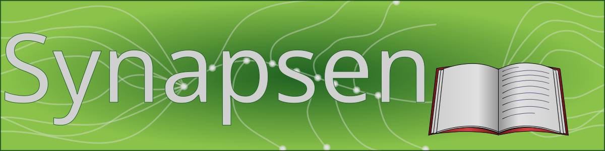

# Synapsen - PDFノート管理ツールセット

`Synapsen` (シナプセン) は、スキャンしたPDFノートやドキュメントを、デジタル・ツェッテルカステン（Zettelkasten）風に管理・閲覧するためのツールセットです。

このプロジェクトは、以下の3つの独立したアプリケーションで構成されています。

1.  **Normalisierer (正規化):** PDFのフォームをテキスト化し、指定サイズ (A4/A5) に統一します。
2.  **Ersteller (作成・統合):** ノートにメタデータを付与・抽出し、月ごとに1冊のPDFに統合します。
3.  **Nexus (閲覧・検索):** 統合されたノートのデータベースを、強力な検索・リンク機能で閲覧します。

## 思想・コンセプト

このツールセットは、書籍[『情報は1冊のノートにまとめなさい［完全版］』](https://ndlsearch.ndl.go.jp/books/R100000002-I025014527)(奥野 宣之 著, ISBN: 9784478022009) で紹介されている、**情報を一元管理する**という思想に強く感銘を受けて作成されました。アナログ・デジタルの情報を一元化し、「時系列」で管理しつつ「タグ」や「目次」で検索性を高めるという理論を、スキャンPDFや電子ペーパー(デジタルノート)で実現することを目的としています。

これに加え、本ツールは伝統的な知識管理術である「**コモンプレイス・ブック (Commonplace Book)**」の概念も取り入れています。
本ツール独自の **Index Key (コモンプレイス Key)** は、この「コモンプレイス」のKey（索引）の概念に由来しており、時系列やタグとは異なる「テーマ」や「概念」でノートを横断するための機能です。

## 構成ツールと機能

### 1. Synapsen Normalisierer (正規化ツール)

スキャンしたPDFやフォーム入力が可能なPDFを、`Ersteller` で処理できる形式に変換します。

* PDFフォームの入力内容を、注釈（アノテーション）を維持したままテキストに変換（フラット化）
* すべてのPDFページを `config.ini` で指定された用紙サイズ（A4またはA5）の縦サイズに（アスペクト比を維持して）リサイズ・中央配置

### 2. Synapsen Ersteller (統合・作成ツール)

正規化されたPDFを読み込み、メタデータを編集し、月報のような形で1つのPDFにまとめ上げます。

* ファイル名から日付やタイトルを自動抽出 (`YYYYMMDD_hhmmss_タイトル.pdf` 形式を推奨)
* PDFの特定座標からIndex Keyを自動抽出（`config.ini` の `[Extraction]` で設定）
* "サイドノート"（例: `..._Note.pdf`）に親ノートのIndex Keyを自動継承
  * これは 電子ペーパー「QUADERNO（クアデルノ）」の "サイドノート" 機能を意識した物です
* ノートごとにタグ、メモ、Index Key（索引キー）を編集
* 指定した月のノート群を1つのPDFに統合
* （LuaLaTeXを使用し）目次、タグ索引、Index Key索引を自動生成
* 統合PDFの索引情報となるマスターCSVファイル（`Nexus`が使用）を作成・更新
* 読み込んだCSVと実際のフォルダ内容を比較・同期する機能

### 3. Synapsen Nexus (閲覧・検索ツール)

`Ersteller` が作成したマスターCSVを読み込む、ノート閲覧・検索用のアプリケーションです。

* `AND`, `OR`, `NOT(-)`, `( )` 演算子を使った高度な検索
* `tag:`, `memo:`, `date:`, `ikey:` (または `cpkey:`, `indexkey:`) などのプレフィックス検索
* 検索結果のノートをダブルクリックすると、統合PDFの該当ページを直接表示（統合PDFが見つからない場合は、`config.ini` の `pdf_root_folder` から元の単一PDFを検索して表示）
* メモ内の `[[key]]` 形式のリンクから、別のノートをプレビュー
* ノート詳細表示時に、そのノートを引用している他のノート（被リンク元）を自動でリストアップ

## 動作環境・依存関係

* **Python 3.x**
* **LuaLaTeX** (TeX Live, MiKTeX などの TeX ディストリビューション)
    * `Synapsen Ersteller` でのPDFビルドに必須です。
    * 導入方法は、こちらの解説記事などを参考にしてください。<br>
        → **[LaTeXの環境構築 \~VSCodeでLaTeXを使いたいだけなのに TeX Liveの導入が必要なのは何故?\~](https://qiita.com/Kurato-Tsukishiro/items/58232e619a1878692bed)**
* **Pythonライブラリ**:
    * [**customtkinter**](https://github.com/TomSchimansky/CustomTkinter) (MIT License) - GUI構築用
    * [**pandas**](https://github.com/pandas-dev/pandas) (BSD-3-Clause License) - 索引CSVデータの管理・検索用
    * [**PyMuPDF (fitz)**](https://github.com/pymupdf/PyMuPDF) (AGPL-3.0 License) - PDFの正規化・情報抽出用 (※プロジェクト全体のAGPLライセンスの要因)
    * [**pypdf**](https://github.com/py-pdf/pypdf) (BSD-3-Clause License) - PDFの統合・正規化用

## セットアップ

1.  **Synapsenのダウンロード:**
    * リポジトリの [Releasesページ](https://github.com/Kurato-Tsukishiro/Synapsen/releases) から、最新のソースコード（`.zip`）をダウンロードします。

2.  **PDFテンプレートの入手 (推奨):**
    * `Synapsen` をより便利に使うため、**専用のPDFテンプレート**（`DotLegalPad_Template-A4_Form.pdf` など）の使用を推奨します。
    * これを使うと、ノート作成時にIndex Keyを選ぶだけで、後で `Ersteller` が自動で読み取ってくれるため、**手動でIndex Keyを登録する手間が省けます**。
    * [Releasesページ](https://github.com/Kurato-Tsukishiro/Synapsen/releases) から、以下のPDFテンプレートファイル（`.pdf`）をダウンロードしてください。
        1.  **フォーム付き (`..._Form.pdf`):** Index Keyを選択するプルダウンが付いたPDF。QUADERNOでは「ドキュメント」として扱われ、**ページ追加ができません**。
        2.  **フォーム無し (`...Template.pdf`):** ページ追加が可能な、通常の「ノート」テンプレート。
    * ※ これらのテンプレートは `CC0 (パブリックドメイン)` です。自由にコピー、改変、再配布して構いません。

3.  **ライブラリのインストール:**
    * ダウンロードしたフォルダにある `Install.bat` をダブルクリックして実行し、必要なPythonライブラリをインストールします。
    * （または、コマンドプロンプトで `pip install -r requirements.txt` を実行します）

4.  **`config.ini` の設定:**
    * フォルダ内にある `config.ini` を開き、**最低限 `[Paths]` セクションのパス**を、ご自身の環境に合わせて編集します。
    * ※ 推奨テンプレート (`DotLegalPad`) を使用する場合、`[Extraction]` や `[CommonplaceKeys]` は**変更不要**です。
    * ※ **テンプレートを使わない場合**は、ご自身で `[Extraction]` の座標を調べるか、`Ersteller` でノートごとに手動でIndex Keyを登録する必要があります。

    **`config.ini` のテンプレート (推奨設定済み):**
    ```ini
    [Paths] # 絶対パス 又は config.ini からの相対パスを指定
    # 事前定義タグを保存しているテキストファイルのパス
    tags_data_path = 

    # Normaliiererが(フォームのテキスト化で)使用するフォントファイルのフルパス
    # Noto San JP を使用する場合は "%LOCALAPPDATA%\Microsoft\Windows\Fonts\NotoSansJP-Regular.otf" を使用して下さい
    font_path = C:\windows\fonts\msgothic.ttc

    # Nexusでの情報表示に使用するマスターCSVのパス
    default_csv_path = 

    # マスターCSVが存在するフォルダ下に統合PDFが存在しない場合に NexusがPDFを開く為に検索するフォルダのパス
    pdf_root_folder = 

    [Automation]
    # Synapse Ersteller で統合PDFを生成した際、
    # [Paths]のdefault_csv_pathで指定されたマスターCSVに、目次情報を自動で「追記」するか (true/false)
    auto_append_to_default_csv = true
    # 上記有効時、目次情報を個別で「保存」するか (true/false)
    create_individual_csv = false

    [LaTeX]
    # 正規化及び統合の用紙サイズの指定 (A4/A5)
    paper_size = 

    # PDF生成時に使用するフォント名
    # font = Noto Sans JP
    font = MS UI Gothic

    # PDFのプロパティに表示される著者名
    author = 

    # PDFのタイトル接頭辞（この後ろに「(YYYY年 M月)」が付きます）
    title_prefix = 

    [Extraction]
    # Erstrller で読み取り Index Keyを取得する範囲 (DotLegalPadテンプレートの座標)
    key_rect = 0, 13, 391, 73

    [CommonplaceKeys]
    # Index Key の設定
    options = タスク,アイデア,思考・考察,コミュニケーション,学習・情報収集,日常・その他

    [KeyIcons]
    # = の左側にキー、右側に表示したいアイコン（Unicode絵文字など）を記述
    タスク = ♥
    アイデア = ♥
    思考・考察 = ♥
    コミュニケーション = ♥
    学習・情報収集 = ♥
    日常・その他 = ♥

    [KeyColors]
    # = の左側にキー、右側に表示したい色（16進数カラーコード）を記述
    # アプリ内のリスト表示・統合ノートのヘッダーおよび索引GbSで使用されます
    タスク = #FE0000
    アイデア = #FFFF02
    思考・考察 = #8802FF
    コミュニケーション = #02FF01
    学習・情報収集 = #02FFFF
    日常・その他 = #F2F2F2
    ```

## 使い方

`Synapsen` はPDFテンプレートを使わなくても利用できます。その場合、`Ersteller` で「フォルダから新規読み込み」を行った後、リストから各ノートをクリックして、手動で「Index Key」を割り当ててください。

以下は、推奨テンプレート（`DotLegalPad` など）を使用して、Index Keyの入力を自動化する推奨ワークフローです。

---

### ステップ0: ノートの作成 (テンプレート利用＠QUADERNO)

QUADERNOでは「フォーム付きPDF（ドキュメント）」にページを追加できません。以下の手順で2種類のテンプレートを使い分けます。

1.  **1ページ目 (Index Keyの指定):**
    * **フォーム付きPDF** (`..._Form.pdf`) をQUADERNO上で**複製**して、新しいノート（ドキュメント）とします。
    * ファイル名を `YYYYMMDD_hhmmss_タイトル.pdf` の形式に変更します。
    * ノート左上のプルダウンメニューから、そのノートの「Index Key」（例: 'アイデア'）を選択し、1ページ目の内容を書き込みます。

2.  **2ページ目以降 (ページの追加):**
    * **フォーム無しPDF** (`...Template.pdf`) を使って、QUADERNOの「**サイドノートを作成**」機能でページを追加します。
    * `Synapsen Ersteller` は、このサイドノート (`..._Note.pdf`) を自動で親ノートと紐付け、Index Keyを継承させます。

3.  **PCへのエクスポート:**
    * 書き終わったら、1ページ目のドキュメント（`..._Form.pdf` を複製したもの）と、2ページ目以降のサイドノート（`..._Note.pdf`）の両方をPCにエクスポートします。
    * (ScanSnapユーザーは、スキャンしたPDFを直接エクスポートフォルダに保存してください)

### ステップ1: 正規化 (Normalisierer)

1.  `Synapsen_Normalisierer_main.py` を実行します。
2.  「処理を開始する」をクリックします。
3.  **入力元フォルダ**（スキャン及びクアデルノで作成したPDFがある場所）を選択します。
4.  **出力先フォルダ**（正規化済みPDFを保存する場所）を選択します。
    * この処理で、フォームで選択した「Index Key」がテキストとしてPDFに焼き付けられます。

### ステップ2: 統合 (Ersteller)

1.  `Synapsen_Ersteller_main.py` を実行します。
2.  「フォルダから新規読み込み」で、ステップ1の「出力先フォルダ」を選択します。
    * ファイル名 (`YYYYMMDD_hhmmss_...`) から日付とタイトルが、PDF内容 (`key_rect` の座標) から「Index Key」が自動で読み込まれます。
    * サイドノート (`..._Note.pdf`) にも親のIndex Keyが自動で継承されます。
3.  リストに表示されたPDFをクリックし、タグ、メモ、Index Keyを編集します。
4.  「統合PDFを生成」をクリックし、保存場所と年月を指定すると、統合PDFと目次CSV (`config.ini` で指定したパス) が生成・更新されます。

### ステップ3: 閲覧 (Nexus)

1.  `Synapsen_Nexus_main.py` を実行します。
2.  アプリは `config.ini` で指定されたマスターCSVを自動で読み込みます。
3.  検索バーやフィルターを使ってノートを検索します。
    * 検索例 : ``tag:Python, memo:[[key]], ikey:タスク AND (アイデア OR 思考)``
4.  ノートをシングルクリックで詳細（メモ、**被リンク元**）を表示、ダブルクリックでPDFの該当ページを開きます。

---

## ライセンス

### ソースコード (AGPL-3.0)

このプロジェクトの**ソースコード**（`.py` ファイルなど）は、**GNU Affero General Public License v3.0 (AGPL-3.0)** の下でライセンスされています。

これは、`Synapsen_Normalisierer` と `Synapsen_Ersteller` の中核機能（フォームのフラット化、PDFからの情報抽出など）において、AGPL-3.0 ライセンスである `PyMuPDF (fitz)` ライブラリを使用しているためです。
AGPL-3.0の条項に基づき、このライブラリを利用する本アプリケーション全体も同じライセンスに従う必要があります。

このソフトウェアを使用（特にネットワーク上でホスト・配布）する場合、**利用者がこのソフトウェアの完全なソースコードを入手できるようにしなければなりません。**

詳細は、同梱されている `LICENSE` ファイルを参照してください。

### アイコンおよびグラフィックアセット (CC BY-SA 4.0)

このリポジトリの **`assets/` フォルダ**に含まれるすべてのファイル（ロゴ、アイコン、`.png` 画像、および `.gvdesign` ソースファイル）は、ソースコードとは別に **Creative Commons Attribution-ShareAlike 4.0 International (CC BY-SA 4.0)** の下でライセンスされています。

詳細は、同梱されている `LICENSE-ASSETS.md` ファイルを参照してください。

### PDFテンプレート (CC0 - パブリックドメイン)

[Releasesページ](https://github.com/Kurato-Tsukishiro/Synapsen/releases) や `PDF_Templates/xxx/PDF/` フォルダで配布されている **`.pdf` テンプレートファイル**（`DotLegalPad_Template-A4_Form.pdf` など）は、**CC0 (パブリックドメイン)** です。

これらのテンプレート（およびそれに書き込んだあなたのノート）は、ライセンスを一切気にすることなく、自由にコピー、改変、共有、再配布が可能です。

---

## 謝辞 (Acknowledgements)

このソフトウェアは、多くの優れたオープンソースライブラリによって実現しています。
特に、GUI構築のための **CustomTkinter**、データ操作のための **pandas**、そしてPDF処理の中核を担う **PyMuPDF** と **pypdf** の開発者コミュニティに心から感謝申し上げます。

また、このコードの作成、リファクタリング、およびドキュメント整備の多くは、GoogleのAIである **Gemini** の支援を受けて行われました。
